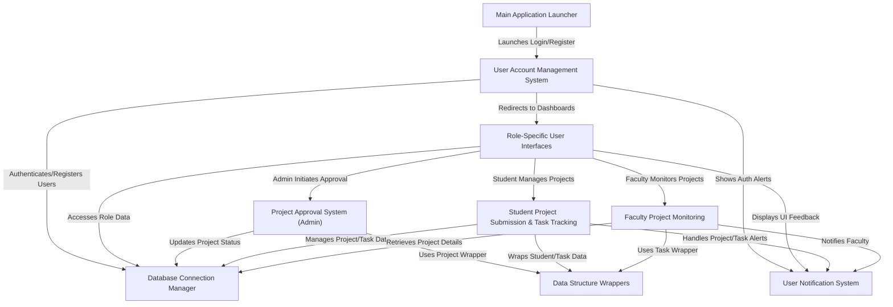

# Java-Project : Internally Funded Student Projects Management System

This is a **Student Project Management System** designed to streamline academic project workflows. It allows *students* to propose new projects, form teams, and track their task progress, while *faculty* can monitor their supervised projects and student contributions. *Administrators* oversee the system by approving or rejecting project proposals and managing overall project statuses, all interacting with a central database and providing consistent user feedback.

## Visual Overview

## Chapters

1. [Main Application Launcher](readme_files/01_main_application_launcher_.md)
2. [User Account Management System](readme_files/02_user_account_management_system_.md)
3. [Role-Specific User Interfaces](readme_files/03_role_specific_user_interfaces_.md)
4. [Database Connection Manager](readme_files/04_database_connection_manager_.md)
5. [Project Approval System (Admin)](readme_files/05_project_approval_system__admin__.md)
6. [Student Project Submission & Task Tracking](readme_files/06_student_project_submission___task_tracking_.md)
7. [Faculty Project Monitoring](readme_files/07_faculty_project_monitoring_.md)
8. [User Notification System](readme_files/08_user_notification_system_.md)
9. [Data Structure Wrappers](readme_files/09_data_structure_wrappers_.md)

---

© 2025 [Pandiarajan D](https://github.com/itz-me-pandian).Educational Purpose