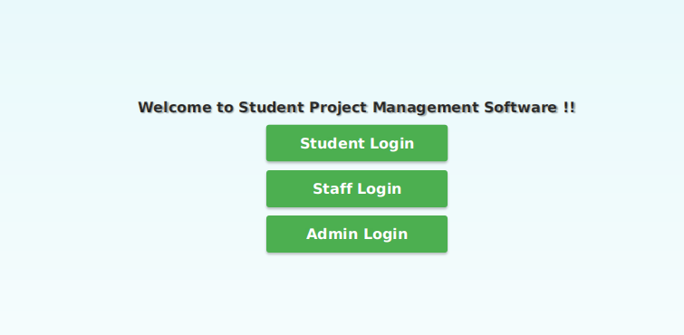
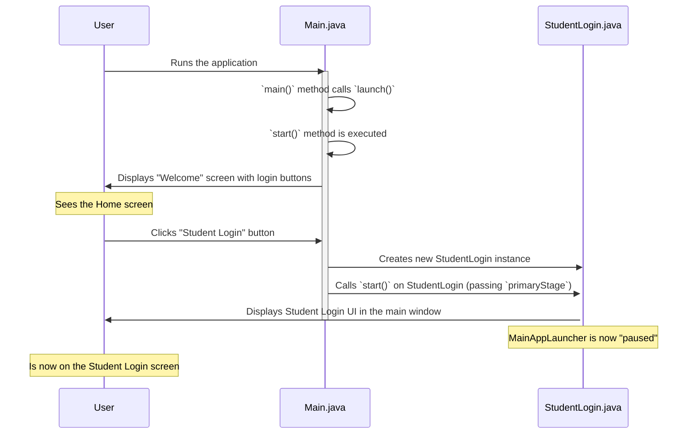

# Chapter 1: Main Application Launcher

Welcome to our Student Project Management System guide! Imagine you've just installed a brand new application on your computer. What's the very first thing you see? Usually, it's a welcome screen or a main menu that gives you options, right?

That's exactly what the **Main Application Launcher** is all about in our project. It's the **starting point** – the main entrance to our entire Student Project Management System.

### Why Do We Need a Main Application Launcher?

Think of our system as a big building with different sections for students, faculty, and administrators. When you enter the building, you don't immediately get sent to a specific office. Instead, you arrive at a main lobby or reception area. This area gives you options: "Are you a student? Are you a faculty member? Are you an admin?" Based on your answer, you're directed to the correct part of the building.

The `Main Application Launcher` solves this problem for our software. It provides that initial "lobby" or "reception area" where:
1.  It greets the user with a welcome message.
2.  It presents different options for logging in or registering, specifically for Students, Faculty (Staff), and Administrators.
3.  It then guides the user to the correct next screen based on their choice.

Without this launcher, users wouldn't know where to start or how to access the different parts of the system!

### How the Launcher Works (High-Level View)

When you run our `Java-Project` application, the first thing you'll see is a window like this:

<div align="center">



</div>

You, as a user, would then simply click on one of the three buttons depending on your role. If you click "Student Login," the application takes you to the student login screen. Easy!

### Diving into the Code: Project/src/UI/Main.java

Let's look at the actual code that creates this welcoming entrance. The core logic for our `Main Application Launcher` resides in the `Main.java` file.

```java
// File: Project/src/UI/Main.java
package UI;

import javafx.application.Application;
import javafx.stage.Stage;

public class Main extends Application
{
    // This is where the application's visual part begins
    @Override
    public void start(Stage primaryStage)
    {
        // ... code to set up the welcome screen ...
        primaryStage.setTitle("Home"); // Sets the window title
        primaryStage.show();          // Displays the window
    }

    // This is the very first method that runs when you start the program
    public static void main(String[] args)
    {
        launch(args); // Tells JavaFX to start our application
    }
}
```

This code snippet shows the two most important parts:

1.  **`main(String[] args)` method:** This is the universal starting point for any Java program. Think of it as opening the application's front door. Inside, `launch(args)` is a special command that tells our JavaFX application (JavaFX is what we use to build graphical user interfaces) to get ready and start showing things on the screen.
2.  **`start(Stage primaryStage)` method:** Once JavaFX is ready, it calls this `start` method. This is where we define *what* the main window looks like and *what* it contains. `primaryStage` is like the blank canvas or the main window frame where we'll put all our buttons and labels.

### Building the Welcome Screen

Now, let's see how the buttons and the welcome message are created within the `start` method.

```java
// Inside the start method of Main.java
import javafx.scene.control.Label;
import javafx.scene.control.Button;
import javafx.scene.layout.VBox; // Used to arrange items vertically
import javafx.scene.Scene;       // The content displayed inside the window
// ... other imports ...

public void start(Stage primaryStage)
{
    // 1. Create a welcome message
    Label welcomeLabel = new Label("Welcome to Student Project Management Software !!");

    // 2. Create buttons for different logins
    Button studentLoginBtn = new Button("Student Login");
    Button staffLoginBtn = new Button("Staff Login");
    Button adminLoginBtn = new Button("Admin Login");

    // We can also set their sizes for a better look
    studentLoginBtn.setPrefSize(200, 40);
    // ... similar lines for staffLoginBtn and adminLoginBtn ...

    // 3. Arrange everything nicely
    VBox rootLayout = new VBox(10); // A box that stacks items vertically with 10 pixels spacing
    rootLayout.setAlignment(Pos.CENTER); // Center everything in the box
    rootLayout.getChildren().add(welcomeLabel); // Add the label
    rootLayout.getChildren().add(studentLoginBtn); // Add student button
    rootLayout.getChildren().add(staffLoginBtn);   // Add staff button
    rootLayout.getChildren().add(adminLoginBtn);   // Add admin button

    // 4. Create the scene (the actual content) and put the arranged items inside it
    Scene mainScene = new Scene(rootLayout, 1600, 1200); // Scene with our layout, 1600x1200 pixels
    // mainScene.getStylesheets().add(getClass().getResource("/resources/style.css").toExternalForm());
    // The line above connects our main screen to a style file to make it look good!

    // 5. Tell the main window (primaryStage) to display this scene
    primaryStage.setScene(mainScene);
    primaryStage.setTitle("Home");
    primaryStage.show();
}
```

This code does the following:
*   It creates a `Label` for the welcome text.
*   It creates three `Button` objects, one for each user type.
*   It uses a `VBox` (Vertical Box) to stack the welcome label and the three buttons neatly, one below the other, in the center of the window.
*   It then puts this `VBox` arrangement into a `Scene`, which is like the content that fills our window.
*   Finally, `primaryStage.setScene(mainScene)` tells our main window to display this scene, and `primaryStage.show()` actually makes the window appear on your screen!

### What Happens When You Click a Button?

The most important part of our launcher is making the buttons actually *do* something. When you click a button, the application needs to switch to a new screen.

```java
// Inside the start method, after creating the buttons and scene
// ... previous code ...

    Scene mainScene = new Scene(rootLayout,1600,1200);
    // ... add stylesheet ...

    // What happens when the "Student Login" button is clicked
    studentLoginBtn.setOnAction(event -> {
        // Create a new StudentLogin screen instance
        // We pass 'mainScene' so the new screen knows which scene to return to later
        Login studentLoginScreen = new StudentLogin(mainScene);
        studentLoginScreen.start(primaryStage); // Tell the new screen to take over the primary window
    });

    // Similar actions for the "Staff Login" button
    staffLoginBtn.setOnAction(event -> {
        Login facultyLoginScreen = new FacultyLogin(mainScene);
        facultyLoginScreen.start(primaryStage);
    });

    // And for the "Admin Login" button
    adminLoginBtn.setOnAction(event -> {
        Login adminLoginScreen = new AdminLogin(mainScene);
        adminLoginScreen.start(primaryStage);
    });

    primaryStage.setScene(mainScene);
    primaryStage.setTitle("Home");
    primaryStage.show();
}
```

The `setOnAction` part is crucial. It tells each button: "When you are clicked, do this specific action."
For example, when `studentLoginBtn` is clicked:
1.  A new `StudentLogin` object is created. Think of `StudentLogin` as a blueprint for the student login screen.
2.  `studentLoginScreen.start(primaryStage)` is called. This command tells the `StudentLogin` object to now display *its* user interface within the same main window (`primaryStage`), effectively switching screens from the welcome page to the student login page.
3.  We pass `mainScene` to the `StudentLogin` constructor so that the login screen knows what the *previous* scene was. This will be important later if we want to add a "Back" button!

### Step-by-Step Flow

Let's visualize the journey when you launch the application and click a button.



### Conclusion

The `Main Application Launcher` (`UI/Main.java`) is the friendly face of our application. It's the first thing users see, providing a clear and easy way to navigate to different parts of the system (Student, Faculty, or Admin login). It sets up the initial window, displays a welcome message, and most importantly, responds to user clicks to switch to the appropriate login screen.

This chapter laid the groundwork for how users begin their interaction. But what happens *after* they select their role and need to log in or register? That's where the next chapter comes in! We'll explore how the system handles user accounts, ensuring only authorized users can access specific features.

Ready to manage user accounts? Let's move on to [Chapter 2: User Account Management System](02_user_account_management_system_.md)!

---

 <sub><sup>**References**: [[1]](https://github.com/itz-me-pandian/Java-Project/blob/e7cb64105871cfd762b59639ef8dcab04ae6c2f7/Project/src/UI/Main.java)</sup></sub>