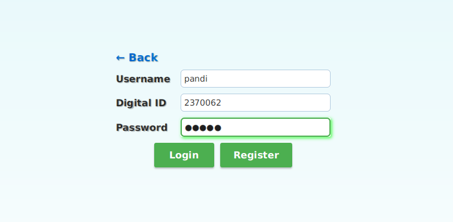
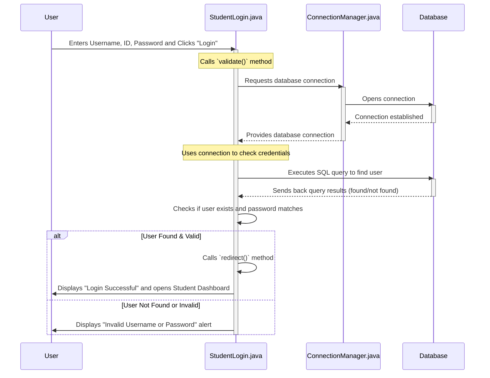

# Chapter 2: User Account Management System

In [Chapter 1: Main Application Launcher](01_main_application_launcher_.md), we learned how our application greets users and presents them with options to log in as a Student, Faculty, or Admin. It’s like the main entrance of a building, guiding you to the right door.

But what happens *after* you choose a door, say, "Student Login"? How does the application know if you're a real student? Or what if you're a new student who needs to create an account?

This is where the **User Account Management System** comes in! Think of it as the **reception desk** behind each of those doors.

### What is the User Account Management System?

Imagine you walk up to a reception desk. You either:
1.  **Show your ID (Login):** You already have an account, and you want to prove who you are to get access.
2.  **Fill out forms for a new ID (Register):** You're new here, and you need to create an account to become a part of the organization.

Our `Java-Project` uses the **User Account Management System** to do exactly this. It's the part of the application responsible for:
*   Allowing existing users to **log in** by checking their username, password, and ID.
*   Allowing new users to **register** for an account.
*   Making sure only valid users get access.
*   Directing users to their specific areas (like a student dashboard or faculty dashboard) once they successfully log in.

### The Problem It Solves

Without this system, anyone could pretend to be a student, faculty member, or admin! We need a secure way to identify users and give them access only to what they are allowed to see and do.

### Key Concepts: Login, Register, and User Types

Our User Account Management System is built around a few core ideas:

1.  **`Login`:** This is the base blueprint for all login screens. It handles the common tasks like showing input fields for username, password, and ID, and a "Login" button.
2.  **`Register`:** This is the base blueprint for all registration screens. It handles common tasks for creating new accounts, like input fields for username, password, ID, and email, and a "Register" button.
3.  **User Types (Student, Faculty, Admin):** Since students, faculty, and admins might have different ID types or different places to store their information, we need specific versions of `Login` and `Register` for each.

The `Login` and `Register` in our project are special types of blueprints called **abstract classes**. This means they define the *general idea* of logging in or registering, but they leave some specific details for their children classes (like `StudentLogin` or `FacultyRegister`) to fill in.

### How You Use It (Behind the Scenes)

Let's say you're a student trying to log in.
1.  From the [Main Application Launcher](01_main_application_launcher_.md), you click "Student Login".
2.  The application then brings up the `StudentLogin` screen.
3.  You type your Username, Digital ID, and Password into the boxes.
4.  You click the "Login" button.

Here's how that login screen might look conceptually:

<div align="center">



</div>

When you click "Login," the `StudentLogin` class takes over, checks your details, and either welcomes you or tells you there was an error.

### Diving into the Code: The `Login` and `Register` Blueprints

Let's look at the foundational code for our `Login` and `Register` processes.

#### The Abstract `Login` Class (`UI/Login.java`)

This class defines what a generic login screen should look like and what basic actions it should perform.

```java
// File: Project/src/UI/Login.java
package UI;

import javafx.application.Application;
import javafx.stage.Stage;
import javafx.scene.Scene;
import javafx.scene.control.*;
import javafx.scene.layout.GridPane;
import javafx.geometry.Pos;

public abstract class Login extends Application {

    private Scene previousScene; // To go back to the Main Launcher
    // Other fields for username, password, digitalID

    Login(Scene passed) {
        this.previousScene = passed;
    }

    public void start(Stage loginStage) {
        loginStage.setTitle("Login Page");

        // ... code to create "Back" button ...
        // ... code to create Username, Digital ID, Password input fields ...
        // ... code to create "Login" and "Register" buttons ...

        // When "Login" button is clicked:
        // It tries to validate the entered details
        // If valid, it redirects to the user's dashboard
        // If not, it shows an error message

        // When "Register" button is clicked:
        // It asks the user if they are a Student or Faculty
        // Then it opens the correct registration screen

        Scene scene = new Scene(new GridPane(), 400, 300); // Simplified Scene creation
        // ... apply stylesheet ...
        loginStage.setScene(scene);
        loginStage.show();
    }

    // This method will be different for Student, Faculty, Admin
    abstract boolean validate(String username, int digitalID, String password) throws Exceptions.LoginException;

    // This method will be different for Student, Faculty, Admin
    abstract void redirect(Stage loginStage, String Username, String Password, int id);
}
```
**Explanation:**
*   `Login` is an `abstract class`. This means you can't create a `Login` object directly; you need to extend it (create a child class) like `StudentLogin` or `FacultyLogin`.
*   It has a `start(Stage loginStage)` method, just like our `Main.java`! This means each login screen will take over the main window to display its own interface.
*   It defines two `abstract` methods: `validate` and `redirect`. These are like "fill-in-the-blank" instructions. Each child class (Student, Faculty, Admin) *must* provide its own way to `validate` credentials and `redirect` the user after a successful login.

#### The Abstract `Register` Class (`UI/Register.java`)

Similarly, this class provides the common structure for all registration screens.

```java
// File: Project/src/UI/Register.java
package UI;

import javafx.application.Application;
import javafx.stage.Stage;
import javafx.scene.Scene;
import javafx.scene.control.*;
import javafx.scene.layout.GridPane;
import javafx.geometry.Pos;
import Exceptions.RegistrationFailedException;

public abstract class Register extends Application {

    Scene previousScene; // To go back to the Login screen
    // Other fields for username, password, digitalID, email

    Register(Scene passed) {
        this.previousScene = passed;
    }

    public void start(Stage RegisterStage) {
        RegisterStage.setTitle("Register");

        // ... code to create "Back" button ...
        // ... code to create Username, Digital ID, Email, Password, Confirm Password fields ...
        // ... code to create "Register" button ...

        // When "Register" button is clicked:
        // It first checks if passwords match and if the email format is valid.
        // Then it tries to validate and save the new user in the database.
        // If successful, it shows a message and redirects to the main login.

        Scene scene = new Scene(new GridPane(), 400, 300); // Simplified Scene creation
        // ... apply stylesheet ...
        RegisterStage.setScene(scene);
        RegisterStage.show();
    }

    // Checks if the email format is correct
    public boolean isValidEmail(String email) {
        String emailRegex = "^[a-zA-Z0-9._%+-]+@[a-zA-Z0-9.-]+\\.[a-zA-Z]{2,6}$";
        return email.matches(emailRegex);
    }

    // Checks if confirmed password matches
    public boolean reCheckPass(String pass, String pass1) {
        return pass1.equals(pass);
    }

    // This method will be different for Student, Faculty
    abstract boolean validate(String username, String pass, int digitalID, String Email) throws RegistrationFailedException;

    // This method will be different for Student, Faculty
    abstract void redirect(Stage RegisterStage);
}
```
**Explanation:**
*   `Register` is also an `abstract class`, providing a common template for registration.
*   It handles basic checks like email format and password confirmation, which are the same for all user types.
*   It also has `abstract` `validate` and `redirect` methods that child classes (`StudentRegister`, `FacultyRegister`) must implement to handle the specifics of saving their particular user type.

### How Login/Register Works Under the Hood (Student Example)

Let's trace what happens when a student tries to log in.



**Step-by-Step Breakdown:**
1.  **User Enters Details:** The user types their information into the `StudentLogin` screen.
2.  **`validate` Method Called:** When "Login" is clicked, the `StudentLogin` object (which extends the `Login` blueprint) calls its specific `validate` method.
3.  **Connect to Database:** Inside the `validate` method, the application needs to talk to our database to check the credentials. It does this by asking the [Database Connection Manager](04_database_connection_manager_.md) for a connection.
4.  **Execute Query:** The `validate` method then builds a special request (an SQL query) to search the database for a student with the entered username, ID, and password. It uses `PreparedStatement` to ensure security against malicious inputs.
5.  **Database Response:** The database looks for a match and sends back the result.
6.  **Check Result:** If a match is found, it means the user is valid.
7.  **`redirect` Method Called:** The `StudentLogin` then calls its `redirect` method, which displays a "Login Successful" message and switches the screen to the [Role-Specific User Interfaces](03_role_specific_user_interfaces_.md) (like the `Student` dashboard).
8.  **Error Message:** If no match is found, an "Invalid Username or Password" message pops up.

### Specific Implementations: `StudentLogin` and `StudentRegister`

Now let's see how `StudentLogin` and `StudentRegister` fill in the blanks from the abstract `Login` and `Register` classes.

#### `StudentLogin.java` (`Project/src/UI/StudentLogin.java`)

This class defines the specific logic for student logins. Notice how it extends `Login`.

```java
// File: Project/src/UI/StudentLogin.java
package UI;

import java.sql.Connection;
import java.sql.PreparedStatement;
import java.sql.ResultSet;
import java.sql.SQLException;
import Connection.ConnectionManager; // Our database helper
import Exceptions.*;
import Student.Student; // The Student dashboard class
import javafx.scene.Scene;
import javafx.stage.Stage;

public class StudentLogin extends Login {

    StudentLogin(Scene passed) {
        super(passed); // Call the parent Login class's constructor
    }

    @Override // We are overriding the abstract method from Login
    public boolean validate(String username, int digitalID, String password) throws LoginException {
        try {
            Connection con = ConnectionManager.getConnection(); // Get database connection

            // SQL query to check if a student with these details exists
            String query = "SELECT * FROM student WHERE name = ? AND password = ? AND digital_id = ?";
            PreparedStatement pstmt = con.prepareStatement(query);

            // Set the actual values into the query to prevent security issues
            pstmt.setString(1, username);
            pstmt.setString(2, password);
            pstmt.setInt(3, digitalID);

            ResultSet r1 = pstmt.executeQuery(); // Run the query
            boolean isValidUser = r1.next();      // Check if any matching record was found

            r1.close(); pstmt.close(); con.close(); // Always close connections!
            return isValidUser;
        } catch (SQLException e) {
            throw new LoginException("Error occurred while connecting with database");
        }
    }

    @Override // We are overriding the abstract method from Login
    public void redirect(Stage loginStage, String Username, String Password, int id) {
        new AlertBox("Student Login Successful", false); // Show a success message
        Student s = new Student(Username, Password, id); // Create a Student object
        s.start(loginStage); // Open the Student's dashboard
    }
}
```
**Explanation:**
*   `StudentLogin` **extends** `Login`, meaning it's a specialized type of `Login`.
*   The `validate` method now contains the actual code to connect to the database (using our [Database Connection Manager](04_database_connection_manager_.md)) and check for matching student credentials.
*   The `redirect` method creates a `Student` object and launches the [Role-Specific User Interfaces](03_role_specific_user_interfaces_.md) for students.

#### `StudentRegister.java` (`Project/src/UI/StudentRegister.java`)

This class handles creating new student accounts.

```java
// File: Project/src/UI/StudentRegister.java
package UI;

import java.sql.Connection;
import java.sql.ResultSet;
import java.sql.SQLException;
import java.sql.Statement;
import Connection.ConnectionManager;
import Exceptions.RegistrationFailedException;
import javafx.scene.Scene;
import javafx.stage.Stage;

public class StudentRegister extends Register {

    StudentRegister(Scene passed) {
        this.previousScene = passed;
    }

    @Override // Implementing the abstract method from Register
    protected boolean validate(String uname, String pwd, int dig, String email) throws RegistrationFailedException {
        Connection con = null; Statement st = null; ResultSet rs = null;
        try {
            con = ConnectionManager.getConnection(); // Get database connection
            st = con.createStatement();

            // First, check if the Digital ID already exists
            String checkQuery = "SELECT * FROM student WHERE digital_id = " + dig;
            rs = st.executeQuery(checkQuery);

            if (rs.next()) { // If a record is found, ID is already in use
                throw new RegistrationFailedException("Registration Failed: Digital ID already exists");
            } else {
                // If ID is unique, insert new student details into the database
                String insertQuery = "INSERT INTO student (name, password, digital_id, email) VALUES ('" + uname + "', '" + pwd + "', " + dig + ", '" + email + "')";
                st.executeUpdate(insertQuery);
                System.out.println("Student registered successfully.");
                return true;
            }
        } catch (SQLException e) {
            throw new RegistrationFailedException("Error during registration: " + e.getMessage());
        } finally { // Always ensure resources are closed
            try { if (rs != null) rs.close(); } catch (SQLException e) {}
            try { if (st != null) st.close(); } catch (SQLException e) {}
            try { if (con != null) con.close(); } catch (SQLException e) {}
        }
    }

    @Override // Implementing the abstract method from Register
    protected void redirect(Stage registerStage) {
        System.out.println("Student Registered Successfully! Redirecting to Home.");
        new Main().start(registerStage); // Go back to the main launcher screen
    }
}
```
**Explanation:**
*   `StudentRegister` **extends** `Register`.
*   Its `validate` method first checks the database to make sure no other student uses the same `digital_id`. This prevents duplicate accounts.
*   If the ID is unique, it then performs an `INSERT` operation to add the new student's details to the database.
*   The `redirect` method, after successful registration, takes the user back to the [Main Application Launcher](01_main_application_launcher_.md) so they can log in with their new account.

You'll find similar `FacultyLogin.java`, `FacultyRegister.java`, and `AdminLogin.java` files that extend these base `Login` and `Register` classes, each with their own specific database tables and redirection logic.

### Conclusion

The **User Account Management System** is crucial for controlling who can access our application and what they can do. By using abstract `Login` and `Register` blueprints, along with specific implementations for Student, Faculty, and Admin, we create a flexible and secure way to handle user authentication and new account creation. This system acts as the gatekeeper, ensuring that only valid users proceed.

Now that users can log in, what do they actually see and do? That's what we'll explore in the next chapter, focusing on the specific interfaces designed for each user role!

Let's move on to [Chapter 3: Role-Specific User Interfaces](03_role_specific_user_interfaces_.md)!

---

<sub><sup>**References**: [[1]](https://github.com/itz-me-pandian/Java-Project/blob/e7cb64105871cfd762b59639ef8dcab04ae6c2f7/Project/src/UI/AdminLogin.java), [[2]](https://github.com/itz-me-pandian/Java-Project/blob/e7cb64105871cfd762b59639ef8dcab04ae6c2f7/Project/src/UI/FacultyLogin.java), [[3]](https://github.com/itz-me-pandian/Java-Project/blob/e7cb64105871cfd762b59639ef8dcab04ae6c2f7/Project/src/UI/FacultyRegister.java), [[4]](https://github.com/itz-me-pandian/Java-Project/blob/e7cb64105871cfd762b59639ef8dcab04ae6c2f7/Project/src/UI/Login.java), [[5]](https://github.com/itz-me-pandian/Java-Project/blob/e7cb64105871cfd762b59639ef8dcab04ae6c2f7/Project/src/UI/Register.java), [[6]](https://github.com/itz-me-pandian/Java-Project/blob/e7cb64105871cfd762b59639ef8dcab04ae6c2f7/Project/src/UI/StudentLogin.java), [[7]](https://github.com/itz-me-pandian/Java-Project/blob/e7cb64105871cfd762b59639ef8dcab04ae6c2f7/Project/src/UI/StudentRegister.java)</sup></sub>