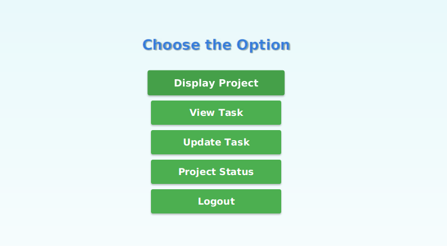

# Chapter 3: Role-Specific User Interfaces

In [Chapter 2: User Account Management System](02_user_account_management_system_.md), we learned how our application verifies who you are – whether you're a Student, Faculty, or Admin – and allows you to log in or register. It's like checking your ID at the entrance of a special building.

But what happens *after* your ID is checked and you're allowed inside? Does everyone see the same things? Imagine walking into a factory: the CEO, the production manager, and a new intern wouldn't all use the exact same control panel, would they? Each would have a panel tailored to their specific job.

This is exactly what **Role-Specific User Interfaces** are all about in our `Java-Project`!

### What Problem Do Role-Specific User Interfaces Solve?

After successfully logging in, it's not enough to just say "Welcome!" We need to give each user the right tools and information.
*   **An Admin** needs buttons to manage the entire system, like approving projects or managing users.
*   **A Faculty member** needs to supervise projects, check student progress, and view all ongoing projects.
*   **A Student** needs to submit project proposals, track their tasks, and see their project's status.

If everyone saw the same screen with all possible buttons, it would be:
1.  **Confusing**: Too many options not relevant to their role.
2.  **Insecure**: A student might accidentally (or intentionally) try to access admin functions.

Role-Specific User Interfaces solve this by presenting a **unique dashboard** to each type of user, showing only the functionalities relevant to their role. It’s like giving each factory worker their own specialized control panel.

### How It Works: A Student's Dashboard Example

Let's trace what happens when a student logs in successfully:

1.  From the `Main Application Launcher` (Chapter 1), the student clicks "Student Login".
2.  They enter their credentials on the `StudentLogin` screen (Chapter 2).
3.  Upon successful login, the application knows this is a "Student."
4.  Instead of a generic screen, it now opens the **Student Dashboard**, which has buttons like "Submit Project", "Display Project", "Update Task", and "View Task". These are the student's specific "control panel" buttons.

Here's a conceptual view of a Student's Dashboard:

<div align="center">



</div>

### Key Components: Our Role-Specific "Control Panels"

In our project, we have dedicated Java classes that define these role-specific dashboards:

*   **`Admin.java`**: Defines the main screen and actions for an Administrator.
*   **`Faculty.java`**: Defines the main screen and actions for a Faculty member.
*   **`Student.java`**: Defines the main screen and actions for a Student.

Each of these classes acts like a blueprint for its respective dashboard. They all extend `javafx.application.Application`, which means they can take over the main window (`Stage`) and display their own distinct user interface (`Scene`).

### Diving into the Code: The `Student` Dashboard (`Student/Student.java`)

Let's look at the `Student.java` file. This class is responsible for creating the Student's main dashboard.

```java
// File: Project/src/Student/Student.java
package Student;

import javafx.application.Application;
import javafx.geometry.Pos;
import javafx.scene.Scene;
import javafx.scene.control.Button;
import javafx.scene.control.Label;
import javafx.scene.layout.VBox;
import javafx.stage.Stage;

import UI.Main; // To go back to the Main Launcher

public class Student extends Application
{
    public String Username,Password;
    public int id;

    // Constructor to receive student details after login
    public Student(String usr,String pwd,int id)
    {
        this.Username = usr;
        this.Password = pwd;
        this.id = id;
    }

    @Override
    public void start(Stage studentStage)
    {
        Label optionLabel = new Label("Choose the Option");
        // Styling for the label (font size, color, etc.)
        optionLabel.setStyle("-fx-font-size: 24px; -fx-font-weight: bold; -fx-text-fill: #4A90E2; -fx-padding: 20px;");

        // Create buttons for student-specific actions
        Button submitProposalButton = new Button("Submit Project ");
        Button displayProjectButton = new Button("Display Project");
        Button updateTaskButton = new Button("Update Task");
        Button viewTaskButton   = new Button("View Task");
        Button projectStatusButton = new Button("Project Status");
        Button backButton = new Button("Logout"); // Logout button returns to main screen

        // Set preferred width for buttons for consistent look
        double buttonWidth = 220;
        submitProposalButton.setPrefWidth(buttonWidth);
        // ... similar lines for other buttons ...

        // Arrange elements vertically in a VBox
        VBox layout;
        // The buttons shown depend on whether the student is already assigned to a project
        if(isStudentNotAssignedToProject(id))
            layout = new VBox(10, optionLabel, submitProposalButton, displayProjectButton, viewTaskButton, backButton);
        else
            layout = new VBox(10, optionLabel, displayProjectButton, viewTaskButton, updateTaskButton, projectStatusButton, backButton);

        layout.setSpacing(10); // Space between items
        layout.setAlignment(Pos.CENTER); // Center all items

        // Create the scene (content of the window)
        Scene studentScene = new Scene(layout, 300, 200);
        // Link to a stylesheet for visual design
        studentScene.getStylesheets().add(getClass().getResource("/resources/style.css").toExternalForm());

        // Define what happens when buttons are clicked
        submitProposalButton.setOnAction(event -> handleSubmitProposal(studentScene,studentStage,Username,Password,id));
        // ... similar actions for other buttons ...
        backButton.setOnAction(event -> new Main().start(studentStage)); // Logout action

        studentStage.setTitle("Student Page"); // Set window title
        studentStage.setScene(studentScene); // Set the scene for the window
        studentStage.show(); // Display the window
    }

    // This method dynamically changes buttons based on project assignment
    public boolean isStudentNotAssignedToProject(int digitalId)
    {
        // ... Database logic to check if student has a project ...
        // We'll learn about database connections in Chapter 4!
        return true; // Simplified for tutorial: always show "Submit Project" initially
    }

    // Example of a button action leading to another student-specific screen
    private void handleSubmitProposal(Scene studentScene,Stage studentStage,String Username,String Password,int id)
    {
        System.out.println("Submit Project Proposal clicked.");
        // projectSubmit is another UI class specific for submitting projects
        // projectSubmit ps = new projectSubmit(studentScene,Username,Password,id);
        // ps.start(studentStage); // This would open the project submission form
    }

    // ... other handle methods for other buttons ...
}
```

**Explanation:**

*   **`Student extends Application`**: This tells JavaFX that `Student` is a top-level UI component, capable of launching its own window (`Stage`).
*   **`Student(String usr, String pwd, int id)`**: This is a constructor. When `StudentLogin` (from Chapter 2) successfully validates a student, it creates an instance of `Student` and passes the student's details (username, password, ID) to it.
*   **`start(Stage studentStage)`**: This is the heart of the dashboard.
    *   It creates a `Label` for the title.
    *   It creates several `Button` objects, each representing a specific action for a student (e.g., "Submit Project", "View Task").
    *   It uses a `VBox` to arrange these buttons neatly, one below the other, in the center of the window.
    *   Crucially, it checks `isStudentNotAssignedToProject(id)` to dynamically show or hide certain buttons. This is a neat way to make the UI smarter!
    *   Each button has an `setOnAction` method that specifies what code should run when the button is clicked. For example, clicking "Submit Project" would open another screen (`projectSubmit`) specifically for project submission.
    *   Finally, it sets the `Scene` (containing our `VBox` with buttons) on the `studentStage` (the main window) and `show()`s it.
*   **`isStudentNotAssignedToProject(int digitalId)`**: This method demonstrates how the dashboard can adapt. It would typically query the database (we'll cover this in [Chapter 4: Database Connection Manager](04_database_connection_manager_.md)) to determine if the student already has a project assigned, and adjust the available options accordingly.

### Similar "Control Panels" for Other Roles

The `Faculty.java` and `Admin.java` classes work in a very similar way. They also have a `start` method that defines their unique set of buttons and actions.

Here’s a quick comparison of the main options each role sees:

| Role        | Main Dashboard Options                                       |
| :---------- | :----------------------------------------------------------- |
| **Student** | Submit Project, Display Project, Update Task, View Task, Project Status, Logout |
| **Faculty** | Check Progress, View All Projects, Logout                    |
| **Admin**   | Display Request (approve/reject), View Students, Logout      |

As you can see, each role gets a dashboard specifically designed for their responsibilities, preventing clutter and ensuring security.

### Internal Flow: From Login to Your Dashboard

Let's quickly visualize how a successful login leads to a role-specific dashboard:

```mermaid
sequenceDiagram
    participant User
    participant StudentLoginUI as StudentLogin.java
    participant StudentDashboard as Student.java

    User->>StudentLoginUI: Enters credentials
    activate StudentLoginUI
    StudentLoginUI->>StudentLoginUI: Validates credentials (using Chapter 2 logic)
    alt Login Successful
        StudentLoginUI->>StudentDashboard: Creates new Student instance (passing ID, etc.)
        StudentLoginUI->>StudentDashboard: Calls `start()` method on StudentDashboard
        deactivate StudentLoginUI
        StudentDashboard->>User: Displays Student Dashboard UI in main window
        Note over StudentDashboard: `Student.java` takes control of the window
    else Login Failed
        StudentLoginUI->>User: Shows error message
        deactivate StudentLoginUI
    end
```

**Step-by-Step Breakdown:**

1.  **User Enters Credentials**: The user interacts with the login screen (e.g., `StudentLogin.java`).
2.  **Validation**: `StudentLogin.java` checks the username and password against the database (as explained in [Chapter 2: User Account Management System](02_user_account_management_system_.md)).
3.  **Create Role Dashboard**: If validation is successful, `StudentLogin.java` creates a new object of the specific role's dashboard class, e.g., `new Student(username, password, id)`.
4.  **Launch Dashboard**: The `start()` method of this new dashboard object (e.g., `s.start(primaryStage)`) is called. This command tells JavaFX to switch the content of the main application window (`primaryStage`) from the login screen to the role-specific dashboard.
5.  **Display Dashboard**: The user now sees their personalized interface, ready to perform tasks relevant to their role.

### Conclusion

Role-Specific User Interfaces (`Admin.java`, `Faculty.java`, `Student.java`) are essential for providing a clear, secure, and user-friendly experience in our `Java-Project`. By tailoring the dashboard and available actions to each user type, we ensure that administrators, faculty members, and students can efficiently perform their tasks without being overwhelmed or accessing unauthorized features. This modular design also makes our application easier to develop and maintain.

Now that our users have their personalized control panels, how do these panels get their information (like project lists or student details) and save new data? That's where connecting to a database comes in!

Let's move on to [Chapter 4: Database Connection Manager](04_database_connection_manager_.md)!

---

<sub><sup>**References**: [[1]](https://github.com/itz-me-pandian/Java-Project/blob/e7cb64105871cfd762b59639ef8dcab04ae6c2f7/Project/src/Admin/Admin.java), [[2]](https://github.com/itz-me-pandian/Java-Project/blob/e7cb64105871cfd762b59639ef8dcab04ae6c2f7/Project/src/Faculty/Faculty.java), [[3]](https://github.com/itz-me-pandian/Java-Project/blob/e7cb64105871cfd762b59639ef8dcab04ae6c2f7/Project/src/Student/Student.java)</sup></sub>