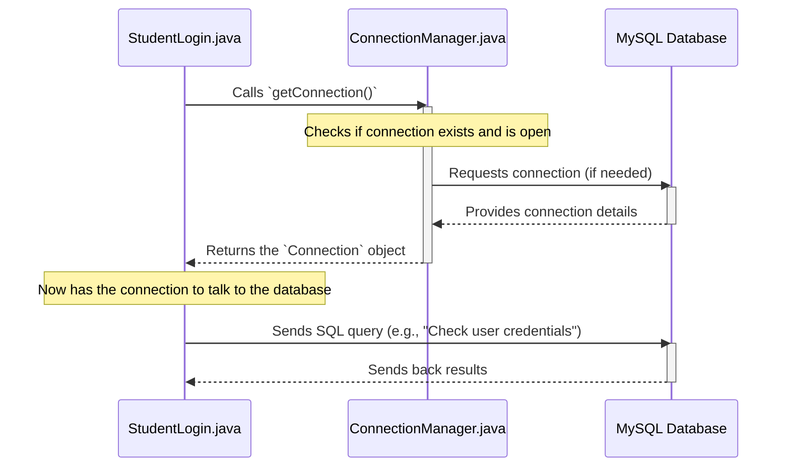

# Chapter 4: Database Connection Manager

In [Chapter 3: Role-Specific User Interfaces](03_role_specific_user_interfaces_.md), we explored how our application presents different dashboards to Students, Faculty, and Admins, giving each role the specific tools they need. Imagine these dashboards are like control panels in different rooms of a building.

But here's a crucial question: where do these control panels *get* their information from? And where do they *save* any new information? For example, when a student clicks "Submit Project," where does that project proposal go? Or when an admin wants to "Display Request" for approval, where do those requests come from?

The answer is simple: **the database**! Our application needs to talk to a database to store and retrieve all this vital information.

### What Problem Does the Database Connection Manager Solve?

Think of our application as a bustling office building with many rooms (our different UI screens and system components). Each room occasionally needs to access the central data archive (our MySQL database).

Now, imagine if every single room had to figure out on its own how to:
1.  Find the archive room.
2.  Get the right key to open it.
3.  Ensure the door is closed properly after use.
4.  Handle what happens if the key doesn't work or the archive is busy.

That would be a lot of repetitive work, and prone to errors!

This is exactly why we need a **Database Connection Manager**. It's like having a **dedicated plumbing system** for our building. Instead of each room managing its own water pipes, the plumbing system provides a reliable way for every room to get water (data) whenever it needs it.

The `Database Connection Manager` (`ConnectionManager.java`) is the special component that handles all the tricky parts of connecting to our MySQL database. It ensures that any part of our `Java-Project` can safely and efficiently ask for data or save data, without needing to worry about the low-level details of how that connection is actually made. It acts as a central point for all database interactions.

### How Our Application Uses the Connection Manager (Example)

Let's revisit the login process from [Chapter 2: User Account Management System](02_user_account_management_system_.md). When a student tries to log in, the `StudentLogin` class needs to check if the entered username, password, and ID match a record in our database.

Here’s a simplified view of how `StudentLogin` (or any part of the application that needs database access) would use our `ConnectionManager`:

```java
// Inside StudentLogin's validate method
// ... other code ...

import java.sql.Connection;
import Connection.ConnectionManager; // This is our special helper!

// Try to get a database connection
Connection databaseConnection = ConnectionManager.getConnection();

// Now, with 'databaseConnection', we can send commands to the database!
// For example, an SQL query to check username and password:
// String query = "SELECT * FROM student WHERE name = ? AND password = ?";
// ... code to execute the query using 'databaseConnection' ...

// ... other code ...
```

As you can see, `ConnectionManager.getConnection()` is the single, simple line of code that gives us access to the database. We don't need to write long lines of code every time we want to connect!

### Diving into the Code: `ConnectionManager.java`

Let's look at the actual code for our `Database Connection Manager`. You can find this file at `Project/src/Connection/ConnectionManager.java`.

```java
// File: Project/src/Connection/ConnectionManager.java
package Connection;

import java.sql.Connection;       // Represents a connection to a database
import java.sql.DriverManager;    // Helps manage a set of JDBC drivers
import java.sql.SQLException;     // Handles database errors

public class ConnectionManager
{
    // A single, shared database connection for the whole application
    private static Connection connection = null;

    /**
     * This method provides a connection to our MySQL database.
     * It ensures we always use the same connection if it's still open and valid.
     * @return A valid Connection object to the database.
     * @throws SQLException If a database access error occurs.
     */
    public static Connection getConnection() throws SQLException
    {
        // Check if the connection is currently null (not yet created)
        // OR if the existing connection has been closed (no longer valid)
        if (connection == null || connection.isClosed())
        {
            // If no valid connection exists, create a new one!
            // This line tells Java to connect to our MySQL database.
            connection = DriverManager.getConnection("jdbc:mysql://localhost:3306/java", "root", "pandi12345678");
            System.out.println("Database connection established or re-established.");
        }
        // Return the (new or existing) valid connection
        return connection;
    }
}
```

#### Explanation of `ConnectionManager.java`:

1.  **`package Connection;`**: This simply means our `ConnectionManager` class belongs to the `Connection` package, helping organize our files.
2.  **`import java.sql.Connection;`**: This brings in the `Connection` type from Java's SQL library. A `Connection` object is what we use to send commands to the database.
3.  **`private static Connection connection = null;`**:
    *   `private`: Means this `connection` variable can only be accessed from *inside* this `ConnectionManager` class.
    *   `static`: This is very important! It means there will only be **one copy** of this `connection` variable, shared by *all* parts of our application that use `ConnectionManager`. This ensures everyone uses the same connection.
    *   `= null`: We start with no connection, it will be created when needed.
4.  **`public static Connection getConnection() throws SQLException`**:
    *   `public static`: This makes the `getConnection` method easily accessible from anywhere in our application (e.g., `ConnectionManager.getConnection()`).
    *   `throws SQLException`: This tells us that if something goes wrong during the database connection process (like the database isn't running, or wrong password), this method might throw a `SQLException`, which we need to handle.
5.  **`if (connection == null || connection.isClosed())`**: This is the "smart" part. Before creating a new connection, it checks two things:
    *   Is `connection` currently `null`? (Has it never been created before?)
    *   Is the existing `connection` already `closed()`? (Did something happen to break it?)
    *   If either of these is true, we need a new connection.
6.  **`connection = DriverManager.getConnection("jdbc:mysql://localhost:3306/java", "root", "pandi12345678");`**: This is the magical line that actually connects to the database!
    *   `DriverManager.getConnection(...)`: This is a built-in Java tool that knows how to make database connections.
    *   `"jdbc:mysql://localhost:3306/java"`: This is the **connection URL**. It tells `DriverManager`:
        *   `jdbc:mysql`: We want to connect using the Java Database Connectivity (JDBC) standard for a MySQL database.
        *   `localhost`: The database is running on *this same computer*.
        *   `3306`: This is the default "port" number that MySQL usually listens on for connections.
        *   `/java`: This is the **name of our database** within MySQL. Our project's data is stored here.
    *   `"root"`: This is the **username** to access the database. In many development setups, "root" is the default super-user.
    *   `"pandi12345678"`: This is the **password** for the "root" user of your MySQL database.
7.  **`return connection;`**: Once we have a valid `Connection` object (either a newly created one or an existing open one), we return it so the calling part of the application can use it.

### Step-by-Step Flow: Getting a Connection for Login

Let's visualize how the `Database Connection Manager` works when `StudentLogin` needs to validate user details:



**Step-by-Step Breakdown:**

1.  **`StudentLogin` needs database access**: When a user clicks "Login," `StudentLogin.java` needs to verify the credentials against the database.
2.  **Requests connection**: `StudentLogin` calls `ConnectionManager.getConnection()` to get a database connection.
3.  **`ConnectionManager` checks status**: The `ConnectionManager` first checks if it already has an active, open connection (`connection == null || connection.isClosed()`).
4.  **Connects to MySQL**: If no valid connection exists, `ConnectionManager` uses `DriverManager.getConnection()` to establish a brand new connection to the MySQL database using the provided URL, username, and password.
5.  **Returns `Connection` object**: `ConnectionManager` then hands over this `Connection` object to `StudentLogin`.
6.  **`StudentLogin` uses connection**: Now `StudentLogin` has the "pipe" to the database. It can use this `Connection` object to create SQL queries (like `SELECT * FROM student ...`) and send them to the `MySQL Database`.
7.  **Database responds**: The database processes the query and sends the results back to `StudentLogin`.

### Conclusion

The `Database Connection Manager` (`ConnectionManager.java`) is a vital utility in our `Java-Project`. It simplifies how different parts of our application talk to the underlying MySQL database by providing a single, consistent, and managed way to get a database connection. This prevents duplicate code, ensures connections are handled efficiently, and centralizes database configuration. With this manager, our application components can focus on *what* data they need, rather than *how* to get it from the database.

Now that our application can securely connect to the database, we can start implementing more complex features that involve storing and retrieving information. In the next chapter, we'll look at the "Project Approval System," which will heavily rely on our ability to interact with the database to manage project submissions and approvals.

Let's move on to [Chapter 5: Project Approval System (Admin)](05_project_approval_system__admin__.md)!

---

<sub><sup>**References**: [[1]](https://github.com/itz-me-pandian/Java-Project/blob/e7cb64105871cfd762b59639ef8dcab04ae6c2f7/Project/src/Connection/ConnectionManager.java)</sup></sub>