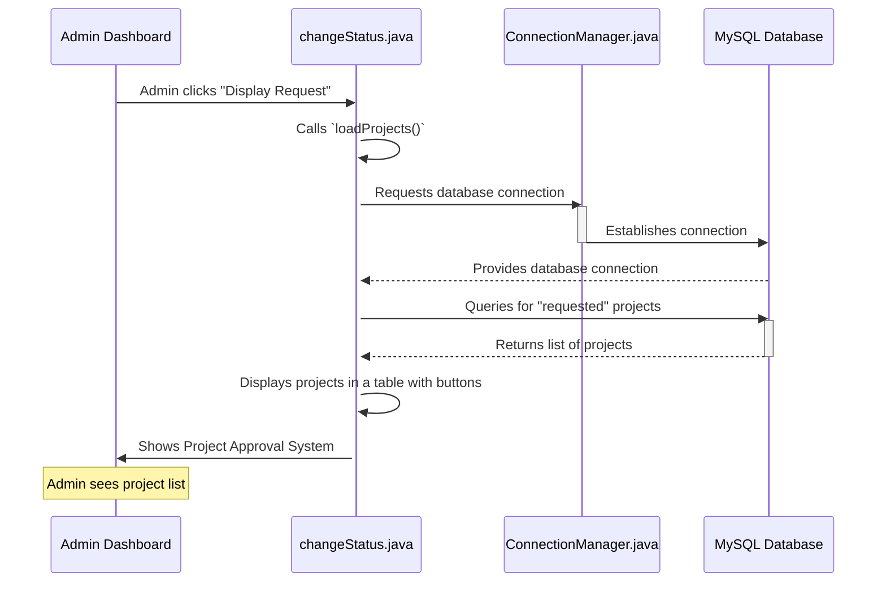
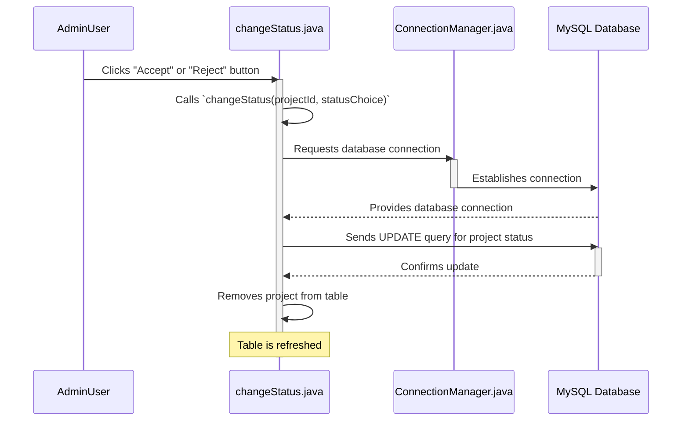

# Chapter 5: Project Approval System (Admin)

In [Chapter 4: Database Connection Manager](04_database_connection_manager_.md), we learned how our application connects to the database, acting like a central "plumbing system" for all data needs. Now that our application can reliably talk to the database, we can build features that fetch, display, and update information!

Imagine you are the chief administrator of a university's project committee. Students submit their project ideas, and it's your job to review them. You need a system that:
1.  Shows you all the project proposals waiting for your decision.
2.  Allows you to easily accept or reject each proposal.
3.  Updates the official record of the project after you make a decision.

This is exactly what the **Project Approval System (Admin)** component does in our `Java-Project`! It’s the administrator's control center for managing student project proposals, much like a real-world committee that reviews applications.

### What Problem Does the Project Approval System (Admin) Solve?

Without a dedicated system, an administrator would have to manually track project submissions, perhaps through emails or spreadsheets. This would be slow, error-prone, and difficult to keep updated.

The **Project Approval System (Admin)** solves this by providing a clear, interactive interface where administrators can:
*   **See a list** of all pending (waiting for approval) project proposals.
*   **Evaluate each proposal** and make an informed decision.
*   **Instantly update** the project's status in the database with a click, changing it from 'requested' to 'accepted' or 'rejected'. This ensures everyone in the system sees the correct, up-to-date information.

It acts as the central hub for administrative oversight of project lifecycles, ensuring that only approved projects move forward.

### How an Administrator Uses It

Let's walk through a typical scenario:

1.  **Admin Login:** An administrator first logs into the application using the [Main Application Launcher](01_main_application_launcher_.md) and the [User Account Management System](02_user_account_management_system_.md).
2.  **Admin Dashboard:** After successful login, they land on their [Role-Specific User Interfaces](03_role_specific_user_interfaces_.md), specifically the Admin Dashboard.
3.  **Access Approval System:** On the Admin Dashboard, there's usually a button like "Display Request" (or "Approve Projects"). The administrator clicks this button.
4.  **View Pending Projects:** The "Project Approval System" screen appears, showing a table of all student project proposals that are currently `requested` (waiting for a decision). Each project has its details (like ID, name) and two buttons: "Accept" and "Reject."
5.  **Make a Decision:** For each project, the administrator can review it and then click either "Accept" or "Reject."
6.  **Status Update:** As soon as a button is clicked, the system instantly updates the project's status in the database and removes that project from the list, because it's no longer 'pending'.

This makes the project approval process efficient and transparent.

### Diving into the Code: Launching the Approval System

From the [Role-Specific User Interfaces](03_role_specific_user_interfaces_.md) chapter, you saw that our `Admin.java` class sets up the Admin Dashboard. Let's see how the "Display Request" button on that dashboard would launch our `changeStatus` screen (which is the core of our Project Approval System).

```java
// Conceptual snippet from Project/src/Admin/Admin.java (Admin Dashboard)

// Inside the start method of Admin.java
// ... other code for Admin dashboard setup ...

Button displayRequestButton = new Button("Display Request");
// ... set button size and style ...

// What happens when the "Display Request" button is clicked
displayRequestButton.setOnAction(event -> {
    // We pass the current scene so we can go back later
    Admin.this.loginStage.setTitle("Project Approval");
    new Admin.changeStatus(adminScene).start(adminStage);
});

// ... add displayRequestButton to layout and show scene ...
```
**Explanation:**
*   When the "Display Request" button is clicked on the Admin Dashboard, it creates a new instance of `Admin.changeStatus`.
*   It passes the current `adminScene` to `changeStatus` so that the "Back" button on the approval screen knows where to return.
*   Finally, `start(adminStage)` tells JavaFX to display the `changeStatus` screen in the main window, replacing the Admin Dashboard.

### How the Approval System Works Under the Hood

When the `changeStatus` screen opens, it performs two main tasks:
1.  **Loads Pending Projects:** It asks the database for all projects with a 'requested' status and displays them in a table.
2.  **Handles Accept/Reject:** When an "Accept" or "Reject" button is clicked, it sends an update command to the database to change that specific project's status.

Let's visualize this flow:



And then for changing a status:



### Deeper Dive: Code for Project Approval

The core logic for the Project Approval System lives in two files:
1.  `Project/src/Admin/Project.java`: A simple "wrapper" class to hold project information.
2.  `Project/src/Admin/changeStatus.java`: The main class that builds the UI, fetches projects, and handles status changes.

#### 1. The `Project` Data Wrapper (`Project/src/Admin/Project.java`)

Before we display projects in a table, we need a way to represent each project's data. That's where the `Project` class comes in. It's a simple container for a project's ID, name, status, and importantly, the "Accept" and "Reject" buttons that will appear next to it in the table.

```java
// File: Project/src/Admin/Project.java
package Admin;

import javafx.scene.control.Button;

public class Project
{
    private int projectId;
    private String projectName;
    private String status;
    private Button acceptButton;
    private Button rejectButton;

    // Constructor to create a Project object
    public Project(int projectId, String projectName, String status, Button acceptButton, Button rejectButton) {
        this.projectId = projectId;
        this.projectName = projectName;
        this.status = status;
        this.acceptButton = acceptButton;
        this.rejectButton = rejectButton;
    }

    // "Getter" methods to get the values
    public int getProjectId() { return projectId; }
    public String getProjectName() { return projectName; }
    public String getStatus() { return status; }
    public Button getAcceptButton() { return acceptButton; }
    public Button getRejectButton() { return rejectButton; }
}
```
**Explanation:**
*   This class is a blueprint for a `Project` object. Each object will hold details for one specific project.
*   It has `private` variables (like `projectId`, `projectName`) to store the data. `private` means these variables can only be accessed directly within this `Project` class.
*   It has `public` "getter" methods (like `getProjectId()`) that allow other parts of the program to read these values. This is a common practice called "encapsulation."
*   Notice how it even stores `Button` objects! This is a clever way to put the interactive buttons directly inside our project data for display in a table.

#### 2. The `changeStatus` UI and Logic (`Project/src/Admin/changeStatus.java`)

This is the main class for our Project Approval System. It builds the screen, fetches data, and updates the database.

Let's break down its key parts:

##### **`start` Method: Setting up the Screen**

```java
// File: Project/src/Admin/changeStatus.java (simplified start method)
package Admin;

import javafx.application.Application;
import javafx.stage.Stage;
import javafx.scene.Scene;
import javafx.scene.control.Label;
import javafx.scene.control.TableView; // To display data in a table
import javafx.scene.layout.VBox; // For vertical arrangement

public class changeStatus extends Application {
    private TableView<Project> projectTable; // Our table to show projects
    private Scene previousScene; // To go back to the Admin dashboard

    public changeStatus(Scene passed) { this.previousScene = passed; }

    @Override
    public void start(Stage primaryStage) {
        primaryStage.setTitle("Change Project Status");

        // "Back" arrow to return to the previous screen
        Label backArrow = new Label("\u2190 Back");
        backArrow.setOnMouseClicked(event -> {
            primaryStage.setScene(previousScene); // Go back to the Admin Dashboard
        });

        projectTable = new TableView<>(); // Initialize our table
        setupTableColumns(); // Define how our table looks
        loadProjects(); // Fill the table with data from the database

        VBox vbox = new VBox(10, backArrow, projectTable); // Arrange items
        vbox.setAlignment(Pos.CENTER); // Center everything

        Scene scene = new Scene(vbox, 600, 500); // Create the scene
        // Link to a stylesheet for visual design
        scene.getStylesheets().add(getClass().getResource("/resources/status.css").toExternalForm());
        primaryStage.setScene(scene); // Set the scene for the window
        primaryStage.show(); // Display the window
    }
    // ... other methods below ...
}
```
**Explanation:**
*   The `start` method, just like in previous chapters, is where our UI is built.
*   It creates a `Label` that acts as a "Back" button, allowing the admin to return to their dashboard.
*   `projectTable = new TableView<>();` creates a new empty table.
*   `setupTableColumns();` configures the columns (like "Project ID," "Project Name").
*   `loadProjects();` is then called to fetch the actual project data from the database and put it into the table.
*   The table and back button are arranged in a `VBox` and displayed in the main window (`primaryStage`).

##### **`setupTableColumns` Method: Defining Table Appearance**

```java
// File: Project/src/Admin/changeStatus.java (setupTableColumns method)
// ... imports and class definition ...

    private void setupTableColumns() {
        // Column for Project ID
        TableColumn<Project, Integer> idColumn = new TableColumn<>("Project ID");
        // Tells the column to get its data from the 'projectId' property of a 'Project' object
        idColumn.setCellValueFactory(new PropertyValueFactory<>("projectId"));

        // Column for Project Name
        TableColumn<Project, String> nameColumn = new TableColumn<>("Project Name");
        nameColumn.setCellValueFactory(new PropertyValueFactory<>("projectName"));

        // Column for Current Status
        TableColumn<Project, String> statusColumn = new TableColumn<>("Current Status");
        statusColumn.setCellValueFactory(new PropertyValueFactory<>("status"));

        // Column for "Action" buttons (Accept/Reject)
        TableColumn<Project, Button> actionColumn = new TableColumn<>("Action");
        actionColumn.setCellValueFactory(new PropertyValueFactory<>("acceptButton")); // Placeholder, we customize it

        // This special code tells JavaFX how to display the "Accept" and "Reject" buttons
        actionColumn.setCellFactory(col -> new TableCell<Project, Button>() {
            @Override
            protected void updateItem(Button item, boolean empty) {
                super.updateItem(item, empty);
                if (empty || item == null) {
                    setGraphic(null); // If no item, show nothing
                } else {
                    // Display both Accept and Reject buttons in a horizontal box
                    HBox hbox = new HBox(5, item, projectTable.getItems().get(getIndex()).getRejectButton());
                    setGraphic(hbox);
                }
            }
        });

        // Add all defined columns to our project table
        projectTable.getColumns().addAll(idColumn, nameColumn, statusColumn, actionColumn);
    }
    // ... other methods below ...
```
**Explanation:**
*   This method defines what columns (`TableColumn`) our `projectTable` will have (ID, Name, Status, Action).
*   `setCellValueFactory` is super important! It links each column to a specific "getter" method in our `Project` data wrapper class (e.g., `idColumn` gets its value from `getProjectId()`).
*   The `actionColumn` is special because it needs to display *two* buttons. `setCellFactory` is used to create a custom cell that shows both the "Accept" and "Reject" buttons next to each other using an `HBox` (Horizontal Box).

##### **`loadProjects` Method: Fetching Data and Creating Buttons**

This is where the magic of talking to the database happens!

```java
// File: Project/src/Admin/changeStatus.java (loadProjects method)
// ... imports and class definition ...
import Connection.ConnectionManager; // Our database helper

    private void loadProjects() {
        try {
            // Clear any existing projects from the table
            projectTable.getItems().clear();

            // 1. Get a database connection using our ConnectionManager
            Connection con = ConnectionManager.getConnection();
            Statement stmt = con.createStatement();

            // 2. Execute a SQL query to get all projects with 'requested' status
            ResultSet rs = stmt.executeQuery("SELECT projectId, projectName, status FROM project WHERE status = 'requested'");

            // 3. Loop through each project found in the database
            while (rs.next()) {
                int projectId = rs.getInt("projectId");
                String projectName = rs.getString("projectName");
                String currentStatus = rs.getString("status");

                // 4. Create "Accept" and "Reject" buttons for this project
                Button acceptButton = new Button("Accept");
                acceptButton.setOnAction(e -> changeStatus(projectId, 1)); // When clicked, call changeStatus
                Button rejectButton = new Button("Reject");
                rejectButton.setOnAction(e -> changeStatus(projectId, 2)); // When clicked, call changeStatus

                // 5. Create a 'Project' object and add it to our table
                projectTable.getItems().add(new Project(projectId, projectName, currentStatus, acceptButton, rejectButton));
            }

            // 6. Always close database resources!
            rs.close(); stmt.close(); con.close();
        } catch (SQLException e) {
            e.printStackTrace(); // Print any database errors
        }
    }
    // ... other methods below ...
```
**Explanation:**
*   It starts by getting a database `Connection` using `ConnectionManager.getConnection()` (just like we learned in [Chapter 4: Database Connection Manager](04_database_connection_manager_.md)).
*   It then executes an `SQL SELECT` query to find all projects where the `status` is `'requested'`.
*   For each project found, it extracts the `projectId`, `projectName`, and `status`.
*   Crucially, for each project, it creates two `Button` objects: "Accept" and "Reject."
*   `acceptButton.setOnAction(e -> changeStatus(projectId, 1));` sets up what happens when "Accept" is clicked: it calls the `changeStatus` method (explained next), passing the `projectId` and a code `1` (for 'accept'). Similarly for 'reject' with code `2`.
*   Finally, it creates a new `Project` object (using our `Project.java` wrapper) with all this data and the generated buttons, and adds it to the `projectTable`. This is how projects appear in the UI!
*   It's very important to `close()` the database resources (`ResultSet`, `Statement`, `Connection`) to prevent problems.

##### **`changeStatus` Method: Updating the Database**

This method is called when an "Accept" or "Reject" button is clicked.

```java
// File: Project/src/Admin/changeStatus.java (changeStatus method)
// ... imports and class definition ...
import Connection.ConnectionManager;

    private void changeStatus(int projectId, int statusChoice) {
        // Determine the new status based on button clicked
        String newStatus = (statusChoice == 1) ? "accepted" : "rejected";
        try {
            // 1. Get a database connection
            Connection con = ConnectionManager.getConnection();
            Statement stmt = con.createStatement();

            // 2. Build the SQL UPDATE query
            String updateQuery = "UPDATE project SET status = '" + newStatus + "' WHERE projectId = " + projectId;
            
            // 3. Execute the update query
            int rowsUpdated = stmt.executeUpdate(updateQuery);

            if (rowsUpdated > 0) {
                System.out.println("Project ID " + projectId + " status updated to '" + newStatus + "'.");
                // 4. If update successful, remove the project from the table
                projectTable.getItems().removeIf(project -> project.getProjectId() == projectId);
            }

            // 5. Close database resources
            stmt.close(); con.close();
        } catch (SQLException e) {
            e.printStackTrace(); // Print any database errors
        }
    }
```
**Explanation:**
*   It takes the `projectId` (of the project whose button was clicked) and `statusChoice` (1 for accept, 2 for reject).
*   It then figures out the `newStatus` string ("accepted" or "rejected").
*   It gets a database connection, similar to `loadProjects`.
*   It creates an `SQL UPDATE` query. This command tells the database: "Find the project with this `projectId` and change its `status` to `newStatus`."
*   `stmt.executeUpdate(updateQuery)` runs this command. `rowsUpdated` will tell us how many records were changed (should be 1).
*   If the update was successful, `projectTable.getItems().removeIf(...)` removes that project from the displayed table, because it's no longer a 'requested' project. This makes the UI immediately reflect the database change.
*   Again, database resources are closed.

### Conclusion

The **Project Approval System (Admin)** is a powerful and essential component of our `Java-Project`. It provides administrators with a clear, interactive interface to manage student project proposals efficiently. By fetching pending requests from the database, allowing immediate decisions via "Accept" and "Reject" buttons, and instantly updating project statuses, it streamlines a critical administrative task. This system heavily relies on the [Database Connection Manager](04_database_connection_manager_.md) to ensure smooth communication with the database.

Now that administrators can approve projects, what about the students who submitted them? How do they create these proposals and track their progress? That's what we'll explore in the next chapter!

Let's move on to [Chapter 6: Student Project Submission & Task Tracking](06_student_project_submission___task_tracking_.md)!

---

<sub><sup>**References**: [[1]](https://github.com/itz-me-pandian/Java-Project/blob/e7cb64105871cfd762b59639ef8dcab04ae6c2f7/Project/src/Admin/Project.java), [[2]](https://github.com/itz-me-pandian/Java-Project/blob/e7cb64105871cfd762b59639ef8dcab04ae6c2f7/Project/src/Admin/changeStatus.java)</sup></sub>