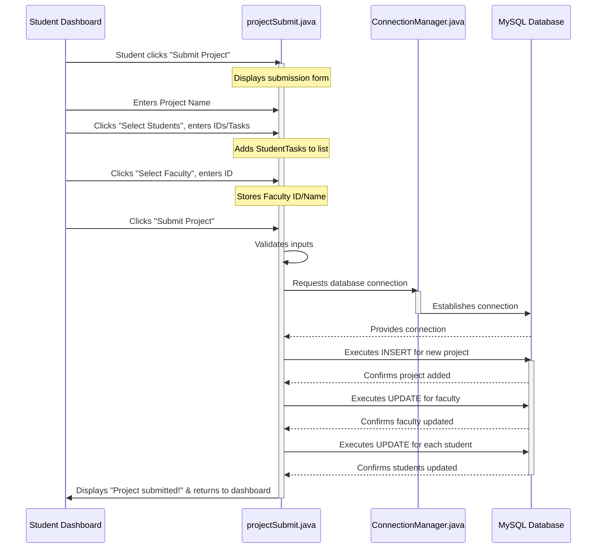
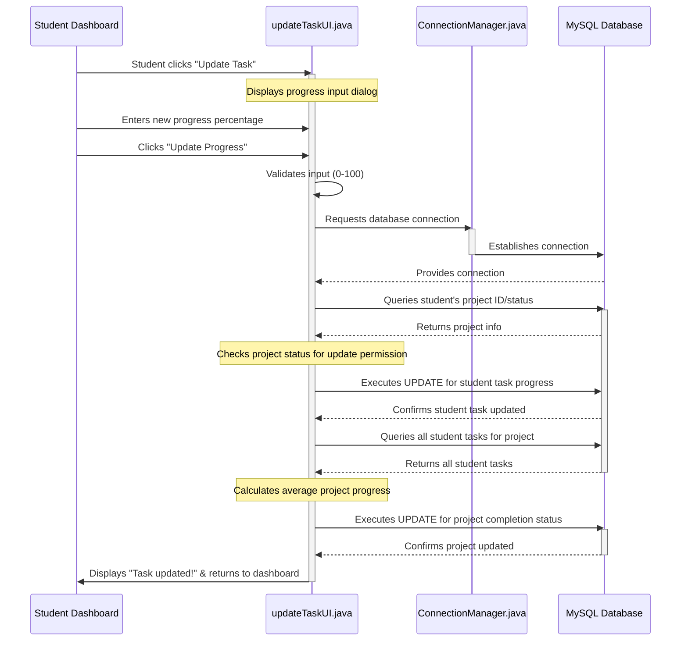

# Chapter 6: Student Project Submission & Task Tracking

In [Chapter 5: Project Approval System (Admin)](05_project_approval_system__admin__.md), we saw how administrators review and approve or reject student project proposals. It’s like the project committee making a final decision on new ideas.

Now, let's switch to the student's perspective! What happens before a project even reaches the admin for approval? How do students come up with an idea, form a team, get a supervisor, and then keep track of their work?

This is where the **Student Project Submission & Task Tracking** system comes in! Imagine this system as a student's **personal project planner**. It's the central place where students manage their entire project journey, from the first spark of an idea to the ongoing progress updates.

### What Problem Does This System Solve?

Without a dedicated system, managing a project can be messy:
*   **Ideas get lost:** Where do you write down your project proposal?
*   **Team chaos:** How do you formally add teammates and assign tasks?
*   **No clear supervisor:** How do you select a faculty member to guide your project?
*   **Progress tracking is hard:** How do you regularly update everyone on what's done and what's left?

The **Student Project Submission & Task Tracking** system solves these problems by giving students a structured way to:
1.  **Propose new projects:** Lay out their idea, give it a name, and submit it for review.
2.  **Form a team:** Add fellow students to their project and assign initial tasks.
3.  **Choose a mentor:** Select a faculty member to oversee their work.
4.  **Track progress:** Regularly update the completion percentage of their assigned tasks.
5.  **View project details:** See all their team members, their faculty mentor, and the overall project status.

It's designed to make the project journey smoother and more organized for every student.

### Your First Project: A Student's Journey

Let's follow a student, say Alex, who wants to start a new project.

1.  **Login:** Alex first logs into the application using the [Main Application Launcher](01_main_application_launcher_.md) and the [User Account Management System](02_user_account_management_system_.md).
2.  **Student Dashboard:** Upon successful login, Alex lands on the [Role-Specific User Interfaces](03_role_specific_user_interfaces_.md), which is the Student Dashboard.
3.  **Submit Project:** Since Alex doesn't have a project yet, they click the "Submit Project" button.
4.  **Fill out the Proposal:** A new screen appears where Alex can enter their project name, select other students for their team, and choose a faculty mentor.
5.  **Submit and Await Approval:** After filling everything out, Alex clicks "Submit." The project proposal is now sent to the administrators for approval (as discussed in Chapter 5!).
6.  **Update Task (Later):** Once the project is approved, Alex and their team can start working. They will periodically come back to the dashboard and use the "Update Task" button to mark their progress (e.g., 25% complete, 50% complete).
7.  **View Task / Display Project:** At any time, Alex can use "View Task" or "Display Project" to see their current task's progress, who else is on the team, and who their faculty mentor is.

### Diving into the Code: Project Submission (`projectSubmit.java`)

The main part of this system for submitting projects is handled by the `projectSubmit.java` file, found in `Project/src/Student/projectSubmit.java`.

#### 1. Setting Up the Project Submission Screen

When a student clicks "Submit Project" from their dashboard, the `start` method in `projectSubmit.java` creates the project submission form.

```java
// File: Project/src/Student/projectSubmit.java (simplified start method)
package Student;

import javafx.application.Application;
import javafx.stage.Stage;
import javafx.scene.Scene;
import javafx.scene.control.*;
import javafx.scene.layout.VBox; // For vertical arrangement
// ... other imports ...

public class projectSubmit extends Application {
    // ... fields like previousScene, Username, Password, id ...

    @Override
    public void start(Stage primaryStage) {
        primaryStage.setTitle("Project Proposal Submission");

        Button backArrow = new Button("Back");
        // ... set backArrow action ...

        Label titleLabel = new Label("Submit Project Proposal");
        TextField projectNameField = new TextField();
        projectNameField.setPromptText("Enter Project Name");

        Button selectStudentsButton = new Button("Select Students");
        Button selectFacultyButton = new Button("Select Faculty");
        Button submitButton = new Button("Submit Project");

        VBox mainLayout = new VBox(15, backArrow, titleLabel,
                                   new Label("Project Name:"), projectNameField,
                                   selectStudentsButton, selectFacultyButton, submitButton);

        Scene mainScene = new Scene(mainLayout, 400, 400);
        // ... add stylesheet ...
        primaryStage.setScene(mainScene);
        primaryStage.show();

        // Event handlers for buttons
        selectStudentsButton.setOnAction(e -> selectStudent());
        submitButton.setOnAction(e -> submitProject(primaryStage, projectNameField.getText()));
        selectFacultyButton.setOnAction(e -> selectFaculty(projectNameField.getText()));
    }
    // ... other methods ...
}
```
**Explanation:**
*   The `start` method constructs the user interface (UI) for project submission.
*   It includes a `TextField` for the `projectName` and `Buttons` for "Select Students," "Select Faculty," and "Submit Project."
*   When these buttons are clicked, they call other methods (`selectStudent`, `selectFaculty`, `submitProject`) to handle the specific actions.

#### 2. Selecting Students for the Team

When a student clicks "Select Students," a new small window (a `Dialog`) pops up. Here, they can enter the `Digital ID` of a teammate and assign them an initial `Task`.

```java
// File: Project/src/Student/projectSubmit.java (simplified selectStudent method)
// ... imports ...
import Connection.ConnectionManager; // Our database helper
import UI.AlertBox;

private void selectStudent() {
    // Limit to 5 students (if `stur` is a counter)
    if (stur >= 5) { new AlertBox("Only a maximum of 5 members allowed", false); return; }

    Dialog<StudentTask> dialog = new Dialog<>();
    // ... dialog setup ...

    TextField digitalIdField = new TextField();
    digitalIdField.setPromptText("Digital ID");
    TextField taskField = new TextField();
    taskField.setPromptText("Task");

    // ... add fields to dialog content ...

    dialog.setResultConverter(dialogButton -> {
        if (dialogButton == ButtonType.OK) {
            try {
                int digitalId = Integer.parseInt(digitalIdField.getText());
                String task = taskField.getText();

                // Check if student is already in a project or already selected
                if (isStudentAlreadyInvolved(digitalId)) {
                    new AlertBox("Student is already assigned to a project!", true); return null;
                }
                // Check if Digital ID exists in database
                Connection con = ConnectionManager.getConnection();
                Statement st = con.createStatement();
                ResultSet r = st.executeQuery("SELECT * FROM student WHERE digital_id = " + digitalId);
                if (r.next()) {
                    selectedStudents.add(new StudentTask(digitalId, task)); // Add to a list
                    stur++; new AlertBox("Student added for the project", false);
                } else {
                    new AlertBox("Invalid Digital ID! Student doesn't exist.", true);
                }
            } catch (Exception e) { new AlertBox("Error: " + e.getMessage(), true); }
        }
        return null;
    });
    dialog.showAndWait();
}

// Helper method to check if a student is already assigned to a project
private boolean isStudentAlreadyInvolved(int digitalId) {
    try (Connection con = ConnectionManager.getConnection();
         Statement st = con.createStatement()) {
        ResultSet rs = st.executeQuery("SELECT projectname FROM student WHERE digital_id = " + digitalId);
        return rs.next() && rs.getString("projectname") != null; // True if projectname is not null
    } catch (SQLException e) {
        new AlertBox("Database Error checking student assignment.", true); return true;
    }
}
```
**Explanation:**
*   The `selectStudent` method creates a pop-up where the student proposing the project can input the `Digital ID` of a teammate and the specific `task` for that teammate.
*   It checks if the entered `digitalId` is valid and if that student is *not already* part of another project using `isStudentAlreadyInvolved`.
*   If everything is good, the new `StudentTask` (a simple object holding the ID and task) is added to a list called `selectedStudents`.

#### 3. Selecting a Faculty Mentor

Similarly, clicking "Select Faculty" brings up a dialog to enter the `Faculty ID` of the desired mentor.

```java
// File: Project/src/Student/projectSubmit.java (simplified selectFaculty method)
// ... imports ...
import Connection.ConnectionManager;
import UI.AlertBox;

private void selectFaculty(String projectName) {
    try {
        TextInputDialog dialog = new TextInputDialog();
        dialog.setTitle("Select Faculty");
        dialog.setHeaderText("Enter Faculty ID:");

        dialog.showAndWait().ifPresent(facultyIdStr -> {
            int facultyId = Integer.parseInt(facultyIdStr);
            this.facultyid = facultyId; // Store faculty ID
            this.facultyname = getFacultyNameById(facultyId); // Get faculty name
        });

        // Check if the faculty ID actually exists in the database
        Connection connection = ConnectionManager.getConnection();
        PreparedStatement preparedStatement = connection.prepareStatement("SELECT * FROM faculty WHERE facultyid = ?");
        preparedStatement.setInt(1, this.facultyid);
        ResultSet resultSet = preparedStatement.executeQuery();

        if (!resultSet.next()) {
            new AlertBox("Faculty ID " + this.facultyid + " does not exist.", true);
        }
        resultSet.close(); preparedStatement.close(); connection.close();
    } catch (SQLException e) { new AlertBox("Database error.", true); }
}

// Helper method to get faculty name from ID
public String getFacultyNameById(int facultyId) {
    String facultyName = null;
    String query = "SELECT name FROM faculty WHERE facultyid = ?";
    try (Connection connection = ConnectionManager.getConnection();
         PreparedStatement preparedStatement = connection.prepareStatement(query)) {
        preparedStatement.setInt(1, facultyId);
        ResultSet resultSet = preparedStatement.executeQuery();
        if (resultSet.next()) { facultyName = resultSet.getString("name"); }
    } catch (SQLException e) { e.printStackTrace(); }
    return facultyName;
}
```
**Explanation:**
*   The `selectFaculty` method uses a `TextInputDialog` to get the `facultyId`.
*   It then queries the database to confirm that a faculty member with that ID exists and retrieves their name.

#### 4. Submitting the Project

After selecting students and a faculty mentor, the student clicks "Submit Project." This is where all the gathered information is saved to the database.

```java
// File: Project/src/Student/projectSubmit.java (simplified submitProject method)
// ... imports ...
import Connection.ConnectionManager;
import UI.AlertBox;

private void submitProject(Stage primaryStage, String projectName) {
    if (selectedStudents.isEmpty()) { new AlertBox("No students selected!", true); return; }
    if (projectName.isEmpty()) { new AlertBox("Project Name cannot be empty!", true); return; }
    if (facultyid == 0) { new AlertBox("No faculty selected!", true); return; }

    try {
        Connection con = ConnectionManager.getConnection();
        Statement st = con.createStatement();

        // Check if project name already exists
        if (!CheckProject(projectName)) { new AlertBox("Project Name already exists!", true); return; }

        // Update Faculty record to link to the new project
        String updateFaculty = "UPDATE faculty SET projectId = " + projId + " WHERE facultyid = " + facultyid + " AND projectId IS NULL";
        st.executeUpdate(updateFaculty);

        // Insert new project details into the 'project' table with 'requested' status
        String insertProject = "INSERT INTO project (projectId, projectname, status, completionstatus, facultyName, facultyId) " +
                               "VALUES (" + projId + ", '" + projectName + "', 'requested', 0, '" + facultyname + "', " + facultyid + ")";
        st.executeUpdate(insertProject);

        // Update each selected student's record with project details and initial task
        for (StudentTask studentTask : selectedStudents) {
            String updateStudent = "UPDATE student SET projectId = " + projId +
                                   ", projectname = '" + projectName +
                                   "', taskname = '" + studentTask.task +
                                   "', taskprogress = 0 WHERE digital_id = " + studentTask.digitalId;
            st.executeUpdate(updateStudent);
        }

        // Increment project ID for next submission
        projId++;
        selectedStudents.clear();
        new AlertBox("Project and tasks submitted successfully!", false);
        new Student(Username, Password, id).start(primaryStage); // Go back to student dashboard
        con.close(); st.close();
    } catch (SQLException e) {
        new AlertBox("Database Error during submission: " + e.getMessage(), true);
    }
}

// Helper method to check if a project name already exists
public static boolean CheckProject(String projectName) {
    String query = "SELECT * FROM project WHERE projectname = ?";
    try (Connection con = ConnectionManager.getConnection();
         PreparedStatement pst = con.prepareStatement(query)) {
        pst.setString(1, projectName);
        ResultSet r = pst.executeQuery();
        return !r.next(); // True if project does NOT exist
    } catch (SQLException e) { new AlertBox("Database Error checking project name!", true); return false; }
}
```
**Explanation:**
*   The `submitProject` method is the core logic for saving the entire project proposal.
*   It first performs validation (e.g., are students selected, is the project name filled?).
*   It then checks if the `projectName` is unique using `CheckProject`.
*   It uses the [Database Connection Manager](04_database_connection_manager_.md) to get a connection and executes multiple SQL commands:
    *   An `UPDATE` query to link the selected `faculty` to this `projectId`.
    *   An `INSERT` query to create a new record in the `project` table, setting its `status` to `'requested'` and `completionstatus` to `0`.
    *   For *each* selected student, an `UPDATE` query to link them to the `projectId`, `projectName`, their `task`, and `taskprogress` (initially 0).
*   Finally, it shows a success message and returns the student to their dashboard.

### Internal Flow: Project Submission



### Tracking Progress: Updating Tasks (`updateTaskUI.java`)

Once a project is approved, students need to regularly update their task progress. This is handled by the `updateTaskUI.java` file (`Project/src/Student/updateTaskUI.java`).

#### 1. The Update Task Screen

When a student clicks "Update Task" from their dashboard, this screen appears.

```java
// File: Project/src/Student/updateTaskUI.java (simplified start method)
package Student;

import javafx.application.Application;
import javafx.stage.Stage;
import javafx.scene.Scene;
import javafx.scene.control.Button;
import javafx.scene.control.Label;
import javafx.scene.control.TextField;
import javafx.scene.layout.VBox; // For vertical arrangement
// ... other imports ...

public class updateTaskUI extends Application {
    private int id; // Student's digital ID
    private Scene previousScene;

    public updateTaskUI(Scene passed, int id) { this.id = id; this.previousScene = passed; }

    @Override
    public void start(Stage primaryStage) {
        primaryStage.setTitle("Update Task Progress"); // Main window title

        Stage dialog = new Stage(); // Create a pop-up dialog
        dialog.setTitle("Update Task Progress");
        // ... dialog setup ...

        Label prompt = new Label("Enter the new Progress Percentage (0 to 100)");
        TextField newProgressField = new TextField();
        newProgressField.setPromptText("New Progress (0-100)");

        Button backButton = new Button("Cancel");
        backButton.setOnAction((event) -> dialog.close());

        Button updateButton = new Button("Update Progress");
        updateButton.setOnAction((e) -> {
            try {
                this.updateTaskProgress(this.id, primaryStage, this.previousScene, newProgressField);
                dialog.close();
            } catch (Exception error) { /* ... error handling ... */ }
        });

        VBox vbox = new VBox(10.0, prompt, newProgressField, updateButton, backButton);
        // ... layout and scene setup for dialog ...
        dialog.showAndWait(); // Show the dialog and wait
    }
    // ... other methods ...
}
```
**Explanation:**
*   The `start` method creates a small pop-up dialog window.
*   This dialog contains a `TextField` where the student can enter their new task progress (a number between 0 and 100).
*   The "Update Progress" button calls the `updateTaskProgress` method to save the new progress.

#### 2. Updating Task Progress in the Database

This method takes the new progress percentage, updates the student's task, and then calculates the overall project's completion status.

```java
// File: Project/src/Student/updateTaskUI.java (simplified updateTaskProgress method)
// ... imports ...
import Connection.ConnectionManager;
import UI.AlertBox;

private void updateTaskProgress(int id, Stage primaryStage, Scene previousScene, TextField newProgressField) throws Exception {
    String newProgress = newProgressField.getText();
    int newProgressValue;
    try {
        newProgressValue = Integer.parseInt(newProgress);
        if (newProgressValue < 0 || newProgressValue > 100) {
            new AlertBox("Invalid progress value! Enter 0-100.", true); return;
        }
    } catch (NumberFormatException e) { new AlertBox("Invalid number!", true); return; }

    try {
        Connection con = ConnectionManager.getConnection();
        Statement st = con.createStatement();

        // 1. Get student's current project ID and status
        ResultSet r = st.executeQuery("SELECT projectId, projectname FROM student WHERE digital_id = " + id);
        if (!r.next()) { new AlertBox("No student found!", true); return; }
        int pid = r.getInt("projectId");
        String projectName = r.getString("projectname");

        // 2. Check project status (e.g., if rejected, don't allow update)
        ResultSet r2 = st.executeQuery("SELECT status FROM project WHERE projectId = " + pid);
        if (r2.next() && (r2.getString("status").equals("requested") || r2.getString("status").equals("rejected") || r2.getString("status").equals("completed"))) {
            // Simplified: In a real app, 'rejected' means cleaning up; 'requested' means cannot update yet.
            // For tutorial, we'll assume it's 'accepted' for updating.
            // Original code has robust error handling for different statuses.
            new AlertBox("Project status prevents update (e.g., requested, rejected, completed).", true); return;
        }

        // 3. Update student's individual task progress
        st.executeUpdate("UPDATE student SET taskprogress = " + newProgressValue + " WHERE digital_id = " + id);

        // 4. Calculate overall project completion status (average of all team members)
        ResultSet allStudentsInProject = st.executeQuery("SELECT taskprogress FROM student WHERE projectId = " + pid);
        int totalProgress = 0; int studentCount = 0;
        while (allStudentsInProject.next()) {
            totalProgress += allStudentsInProject.getInt("taskprogress");
            studentCount++;
        }
        int avgProgress = (studentCount > 0) ? totalProgress / studentCount : 0;

        // 5. Update the project's overall completion status
        String updateProjectQuery = "UPDATE project SET completionstatus = " + avgProgress;
        if (avgProgress == 100) { // If 100%, mark project as 'completed'
            updateProjectQuery += ", status = 'completed'";
        }
        updateProjectQuery += " WHERE projectId = " + pid;
        st.executeUpdate(updateProjectQuery);

        new AlertBox("Task progress updated successfully to " + newProgressValue + "%!", false);
        primaryStage.setScene(previousScene); // Return to student dashboard
        r.close(); r2.close(); allStudentsInProject.close(); st.close(); con.close();
    } catch (SQLException e) { new AlertBox("Database Error: " + e.getMessage(), true); }
}
```
**Explanation:**
*   The `updateTaskProgress` method first gets the new percentage from the `TextField` and validates it.
*   It then connects to the database using `ConnectionManager.getConnection()`.
*   It fetches the student's `projectId` and checks the project's current `status` (to ensure it's not rejected, requested, or already completed).
*   It runs an `SQL UPDATE` query to change the `taskprogress` for that specific student.
*   Next, it calculates the *average* `taskprogress` of *all* students in that project.
*   Finally, it updates the `completionstatus` of the overall project in the `project` table. If the average reaches 100%, the project's `status` is also changed to `'completed'`.

### Internal Flow: Task Tracking



### Viewing Project & Task Details (`ViewProject.java`, `StudentTask.java`, `projectPage.java`)

Students can also view their project details, including team members, faculty, and individual task status. These features are powered by `ViewProject.java`, which provides the backend data, and `StudentTask.java`/`projectPage.java` which display the UI.

#### 1. Displaying Individual Task Details (`StudentTask.java`)

When a student clicks "View Task," `StudentTask.java` fetches and displays their specific task's name and progress.

```java
// File: Project/src/Student/StudentTask.java (simplified start method)
package Student;

import javafx.application.Application;
import javafx.stage.Stage;
import javafx.scene.Scene;
import javafx.scene.control.Label;
import javafx.scene.control.Button;
import javafx.scene.layout.VBox;
// ... other imports ...

public class StudentTask extends Application {
    // ... fields like username, password, digitalId, previousScene ...

    @Override
    public void start(Stage primaryStage) {
        // ... layout setup ...
        Button backArrow = new Button("Back");
        backArrow.setOnAction(event -> primaryStage.setScene(previousScene));

        // Fetch task details using ViewProject helper
        ViewProject viewProject = new ViewProject();
        TaskDetails taskDetails = null; // TaskDetails is a wrapper class inside StudentTask.java
        try {
            taskDetails = viewProject.viewTask(username, password, digitalId); // Get task info
        } catch (Exception e) { new AlertBox("Failed to fetch task details: " + e.getMessage(), true); return; }

        try {
            Label header = new Label("Your Current Status of your Task in the Project!");
            Label projectNameLabel = new Label("Project Name : " + taskDetails.getProjectName());
            Label taskNameLabel = new Label("Task Name : " + taskDetails.getTaskName());
            Label taskProgressLabel = new Label("Progress : " + taskDetails.getTaskProgress());

            VBox layout = new VBox(10, backArrow, header, projectNameLabel, taskNameLabel, taskProgressLabel);
            // ... scene and stage setup ...
            primaryStage.show();
        } catch (NullPointerException e) { new AlertBox(e.getMessage(), true); }
    }
    // ... other methods ...
}
```
**Explanation:**
*   `StudentTask.java`'s `start` method first uses `ViewProject.java`'s `viewTask` method (explained next) to fetch the student's task details from the database.
*   It then creates `Label`s to display the `Project Name`, `Task Name`, and `Progress` on the screen.

#### 2. Fetching Task Data (`ViewProject.java`)

The `ViewProject.java` file (`Project/src/Student/ViewProject.java`) contains the core database logic for retrieving project and task information.

```java
// File: Project/src/Student/ViewProject.java (simplified viewTask method)
package Student;

import java.sql.Connection;
import java.sql.ResultSet;
import java.sql.SQLException;
import java.sql.Statement;
import Connection.ConnectionManager;
import UI.AlertBox;

public class ViewProject {
    // ... other methods ...

    public TaskDetails viewTask(String uname, String pwd, int dig) {
        Connection con = null; Statement st = null; ResultSet r = null;
        try {
            con = ConnectionManager.getConnection();
            st = con.createStatement();
            String query = "SELECT projectname, taskname, taskprogress FROM student WHERE digital_id = " + dig;
            r = st.executeQuery(query);

            if (r.next()) {
                String projectName = r.getString("projectname");
                String taskName = r.getString("taskname");
                String progressDisplay = r.wasNull("taskprogress") ? "Not set" : r.getInt("taskprogress") + "%";
                return new TaskDetails(projectName, taskName, progressDisplay); // Return wrapped data
            } else {
                new AlertBox("No tasks found for student ID: " + dig, true);
                return new TaskDetails("No Project", "No Task", "No Progress");
            }
        } catch (SQLException e) {
            throw new RuntimeException("Database error fetching task details: " + e.getMessage(), e);
        } finally { // Always close resources
            try { if (r != null) r.close(); if (st != null) st.close(); if (con != null) con.close(); }
            catch (SQLException e) { System.out.println("Error closing resources: " + e.getMessage()); }
        }
    }
    // ... other methods ...
}
```
**Explanation:**
*   The `viewTask` method in `ViewProject.java` connects to the database.
*   It executes an `SQL SELECT` query to get the `projectname`, `taskname`, and `taskprogress` directly from the `student` table for the given `digital_id`.
*   It then wraps this information into a `TaskDetails` object (a simple data container defined in `StudentTask.java`) and returns it.

#### 3. Displaying Full Project Details (`projectPage.java`)

When a student clicks "Display Project," `projectPage.java` provides a comprehensive view of their project, including other team members and their faculty mentor.

```java
// File: Project/src/Student/projectPage.java (simplified start method)
package Student;

import javafx.application.Application;
import javafx.stage.Stage;
import javafx.scene.Scene;
import javafx.scene.control.*;
import javafx.scene.layout.VBox; // For vertical arrangement
import java.sql.ResultSet;
import Connection.ConnectionManager;
import UI.AlertBox;

public class projectPage extends Application {
    private String Username, Password;
    private int id;
    private Scene previousScene;
    // ... other fields ...

    public projectPage(Scene passed, String Username, String Password, int id) { /* ... constructor ... */ }

    @Override
    public void start(Stage projectStage) {
        // ... back button ...

        // Use a helper class (displayStud) to retrieve comprehensive student/project info
        displayStud studentDetailsFetcher = new displayStud(Username, Password, id);
        try {
            studentDetailsFetcher.retrieveStudentInfo(); // This fills internal data from DB

            Label facultyLabel = new Label("Faculty Mentor Information:");
            TextField facultyIdField = new TextField(studentDetailsFetcher.getFacultyId());
            TextField facultyNameField = new TextField(studentDetailsFetcher.getFacultyName());
            // ... disable editing and style fields ...

            TableView<ProjectTask> studentTable = new TableView<>(); // Table to show team members
            // ... setup columns for Student Name, Task Name, Task Progress ...

            // Fill the table with data
            populateStudentTable(studentDetailsFetcher.getStudentResultSet(), studentTable);

            Label projectNameLabel = new Label("Project Name : " + this.projname); // projname set in populateStudentTable

            VBox layout = new VBox(15, projectNameLabel, studentTable, facultyLabel, facultyIdField, facultyNameField);
            // ... layout, scene, stage setup ...
            projectStage.show();
        } catch (Exception e) { new AlertBox("Error displaying project: " + e.getMessage(), true); }
    }

    // Helper method to fill the TableView with student data from a ResultSet
    private void populateStudentTable(ResultSet studentResultSet, TableView<ProjectTask> studentTable) {
        try {
            // Loop through each student record in the ResultSet
            while (studentResultSet != null && studentResultSet.next()) {
                String studentName = studentResultSet.getString("name");
                String taskName = studentResultSet.getString("taskname");
                String taskProgress = studentResultSet.getString("taskprogress");
                this.projname = studentResultSet.getString("projectname"); // Store project name

                // Add to table
                studentTable.getItems().add(new ProjectTask(taskName, taskProgress, studentName));
            }
        } catch (SQLException e) { new AlertBox("Error loading student data: " + e.getMessage(), true); }
    }

    // Inner class to wrap student task data for the TableView
    public static class ProjectTask {
        private String taskName, taskProgress, studentName;
        public ProjectTask(String taskName, String taskProgress, String studentName) { /* ... */ }
        // ... getters for taskName, taskProgress, studentName ...
    }
}
```
**Explanation:**
*   `projectPage.java`'s `start` method uses another helper class, `displayStud`, to get a `ResultSet` containing information about all students involved in the current student's project, as well as the faculty mentor details.
*   It displays the `Faculty ID` and `Name` in `TextField`s.
*   It creates a `TableView` to list each team member, their assigned `Task Name`, and their `Task Progress`.
*   The `populateStudentTable` method iterates through the `ResultSet` from the database, creating `ProjectTask` objects (simple data wrappers) and adding them to the `TableView`.

### Conclusion

The **Student Project Submission & Task Tracking** system is the cornerstone for students in our `Java-Project`, enabling them to take full ownership of their projects. From proposing new ideas, building teams, and selecting mentors through the `projectSubmit.java` UI, to diligently updating their progress with `updateTaskUI.java`, and finally, viewing a comprehensive overview of their project and tasks using `StudentTask.java` and `projectPage.java`. This system ensures projects are well-managed, transparent, and driven by the students themselves, all while securely interacting with the database using the [Database Connection Manager](04_database_connection_manager_.md).

Now that students can manage their projects, how do faculty members monitor the projects they are mentoring? That's what we'll explore in the next chapter!

Let's move on to [Chapter 7: Faculty Project Monitoring](07_faculty_project_monitoring_.md)!

---

<sub><sup>**References**: [[1]](https://github.com/itz-me-pandian/Java-Project/blob/e7cb64105871cfd762b59639ef8dcab04ae6c2f7/Project/src/Student/StudentTask.java), [[2]](https://github.com/itz-me-pandian/Java-Project/blob/e7cb64105871cfd762b59639ef8dcab04ae6c2f7/Project/src/Student/ViewProject.java), [[3]](https://github.com/itz-me-pandian/Java-Project/blob/e7cb64105871cfd762b59639ef8dcab04ae6c2f7/Project/src/Student/projectPage.java), [[4]](https://github.com/itz-me-pandian/Java-Project/blob/e7cb64105871cfd762b59639ef8dcab04ae6c2f7/Project/src/Student/projectSubmit.java), [[5]](https://github.com/itz-me-pandian/Java-Project/blob/e7cb64105871cfd762b59639ef8dcab04ae6c2f7/Project/src/Student/updateTaskUI.java)</sup></sub>