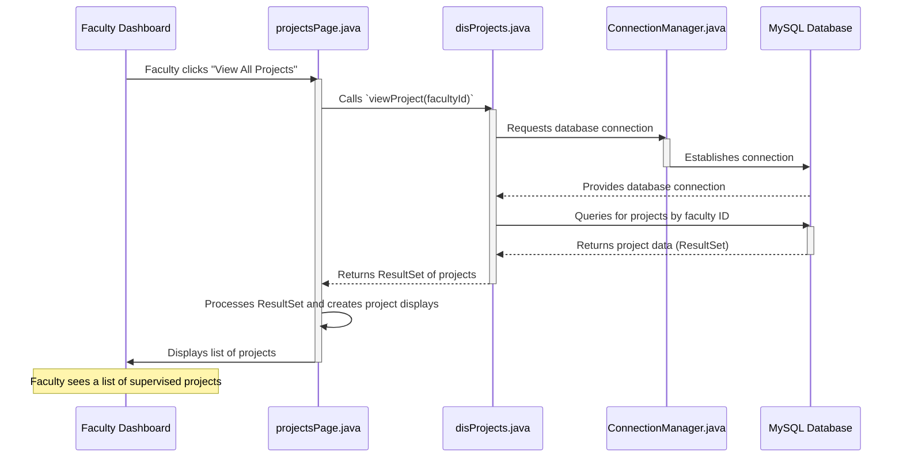
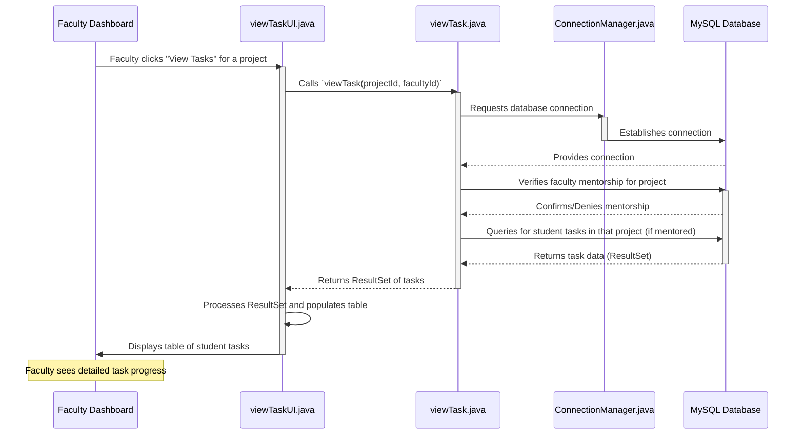

# Chapter 7: Faculty Project Monitoring

In [Chapter 6: Student Project Submission & Task Tracking](06_student_project_submission___task_tracking_.md), we explored how students propose projects, form teams, select mentors, and track their task progress. This covered the student's entire project journey.

Now, let's look at things from the **faculty member's** point of view! When a student selects a faculty member as their mentor, that faculty member needs a way to oversee the project. How can they quickly see what projects they are mentoring, check on their students' progress, and provide effective guidance?

This is where the **Faculty Project Monitoring** system comes in!

### What Problem Does Faculty Project Monitoring Solve?

Imagine you're a busy faculty member mentoring several student projects. Without a proper system, keeping track of each project would be a manual and time-consuming task:
*   You might have to ask each student individually for updates.
*   It would be hard to get an overview of all your projects at once.
*   Drilling down to see specific task progress for a team member would be tedious.

The **Faculty Project Monitoring** system solves these challenges. It provides faculty members with a **supervisor's dashboard**, acting as a central hub where they can:
1.  **View all projects** they are currently mentoring.
2.  **See the overall status** and completion percentage of each project.
3.  **Drill down** into a specific project to view the detailed task progress of each individual student within that team.

This system makes it easy for faculty to stay informed, offer timely advice, and evaluate project progress effectively, all from one organized interface.

### How a Faculty Member Uses It: A Walkthrough

Let's follow a faculty member, Professor Smith, as they use this system:

1.  **Login:** Professor Smith logs into the application using the [Main Application Launcher](01_main_application_launcher_.md) and the [User Account Management System](02_user_account_management_system_.md).
2.  **Faculty Dashboard:** After logging in, they land on their [Role-Specific User Interfaces](03_role_specific_user_interfaces_.md), which is the Faculty Dashboard.
3.  **View All Projects:** On the dashboard, Professor Smith clicks a button like "View All Projects" or "Check Progress."
4.  **List of Projects Appears:** The system displays a list of all projects that Professor Smith is currently mentoring. For each project, they can see its ID, name, overall status (e.g., 'accepted'), and the project's completion percentage.
5.  **Select a Project to Drill Down:** Professor Smith notices one project is moving slowly. They click on a button next to that project (e.g., "View Tasks").
6.  **Task Details Appear:** A new screen shows a detailed list of all students on that project, their individual assigned tasks, and the specific progress (e.g., 25%, 70%) for each task.

With this information, Professor Smith can now contact the specific student who is falling behind or offer general advice to the team.

### Key Components of Faculty Project Monitoring

This monitoring system is built using two main parts in our project:
*   **`projectsPage.java`**: This class helps faculty members see a list of *all* the projects they are mentoring, along with their high-level status.
*   **`viewTaskUI.java`**: This class allows faculty to "zoom in" and see the detailed task progress of individual students within a specific project.

Both these components work together to provide a comprehensive monitoring solution for faculty.

### Part 1: Viewing All Supervised Projects

The first step for a faculty member is to get an overview of all their supervised projects.

#### How It Works (High-Level)

When Professor Smith clicks "View All Projects" on their dashboard:
1.  The system identifies Professor Smith's unique Faculty ID.
2.  It then asks the database: "Show me all projects where the `facultyId` matches Professor Smith's ID."
3.  The database sends back a list of matching projects.
4.  The system then displays this list in an easy-to-read format on the screen, showing the project ID, name, status, and overall completion.

#### Step-by-Step Flow: Getting a Project Overview

Let's visualize how the system fetches and displays these projects:



#### Diving into the Code: Fetching and Displaying Projects

The code for fetching a faculty member's projects is in `Project/src/Faculty/projectsPage.java`. This file contains two main parts: a helper class `disProjects` that talks to the database, and `projectsPage` which builds the user interface.

##### 1. `disProjects`: Fetching Project Data from the Database

The `disProjects` class has a method called `viewProject` that connects to the database and retrieves all projects linked to a specific faculty ID.

```java
// File: Project/src/Faculty/projectsPage.java (snippet from disProjects class)
package Faculty;

import java.sql.Connection;
import java.sql.ResultSet;
import java.sql.SQLException;
import java.sql.Statement;
import Connection.ConnectionManager; // Our database helper

class disProjects {
    public ResultSet viewProject(int fid) throws NullPointerException {
        try {
            Connection con = ConnectionManager.getConnection(); // Get DB connection
            Statement st = con.createStatement();
            String projectQuery = "SELECT * FROM project WHERE facultyId = " + fid;
            ResultSet projectResultSet = st.executeQuery(projectQuery);

            if (projectResultSet.next()) { // Check if any project was found
                return projectResultSet;
            } else {
                throw new NullPointerException("No projects found for faculty ID: " + fid);
            }
        } catch (SQLException e) {
            throw new NullPointerException("Database error: " + e.getMessage());
        }
    }
}
```
**Explanation:**
*   `viewProject(int fid)`: This method takes the `facultyId` (ID of the faculty member) as input.
*   `ConnectionManager.getConnection()`: It uses our [Database Connection Manager](04_database_connection_manager_.md) to get a connection to the database.
*   `SELECT * FROM project WHERE facultyId = " + fid`: This is an SQL query that asks the database to find all rows in the `project` table where the `facultyId` column matches the given `fid`.
*   `st.executeQuery(projectQuery)`: This runs the SQL query and gets the results back as a `ResultSet`.
*   `projectResultSet.next()`: This checks if the `ResultSet` actually contains any projects. If yes, it returns the `ResultSet` so the UI can display it. If no, it throws an error.

##### 2. `projectsPage`: Displaying the Projects on Screen

The `projectsPage` class uses the `ResultSet` from `disProjects` to build and display the list of projects.

```java
// File: Project/src/Faculty/projectsPage.java (simplified start method)
package Faculty;

import javafx.application.Application;
import javafx.stage.Stage;
import javafx.scene.Scene;
import javafx.scene.control.Button;
import javafx.scene.control.Label;
import javafx.scene.layout.VBox; // Arranges items vertically
import java.sql.ResultSet;
import java.sql.SQLException;

public class projectsPage extends Application {
    private ResultSet r; // The ResultSet containing project data
    public Scene previousScene; // To go back to the Faculty Dashboard

    public projectsPage(ResultSet r, Scene passed) {
        this.r = r;
        this.previousScene = passed;
    }

    @Override
    public void start(Stage projectStage) {
        projectStage.setTitle("Faculty Projects");
        VBox layout = new VBox(10); // Vertical box for arranging items
        // ... styling and padding ...

        Button backArrow = new Button("Back");
        backArrow.setOnAction(event -> projectStage.setScene(previousScene)); // Go back action
        layout.getChildren().add(backArrow);

        try {
            // Loop through each project in the ResultSet
            // Note: r.next() was already called once in disProjects to check if it has data
            do {
                int projectId = r.getInt("projectId");
                String projectName = r.getString("projectname");
                String projectStatus = r.getString("status");
                int completionStatus = r.getInt("completionstatus");

                // Create Labels to display project details
                Label projIdLabel = new Label("Project ID: " + projectId);
                Label projNameLabel = new Label("Project Name: " + projectName);
                Label projStatusLabel = new Label("Project Status: " + projectStatus);
                Label projCompStatusLabel = new Label("Completion: " + completionStatus + "%");

                // Put all labels for one project into a small box
                VBox projectBox = new VBox(5, projIdLabel, projNameLabel,
                                             projStatusLabel, projCompStatusLabel);
                // ... styling for projectBox ...
                layout.getChildren().add(projectBox); // Add this project box to the main layout

            } while (r.next()); // Move to the next project (if any)
        } catch (SQLException e) {
            e.printStackTrace(); // Show any database errors
        }

        Scene scene = new Scene(layout, 600, 400);
        // ... apply stylesheet ...
        projectStage.setScene(scene);
        projectStage.show();
    }
}
```
**Explanation:**
*   The `start` method sets up the window and a "Back" button to return to the Faculty Dashboard.
*   `VBox layout = new VBox(10);`: This creates a vertical box to stack all the project information.
*   `do { ... } while (r.next());`: This loop is crucial. It goes through each project returned by the `ResultSet` (`r`).
    *   `r.getInt("projectId")`, `r.getString("projectname")`, etc.: These lines extract the data for the current project from the `ResultSet`.
    *   `Label projIdLabel = new Label(...)`: New `Label` objects are created to display each piece of project information.
    *   `VBox projectBox = new VBox(...)`: All the labels for a single project are grouped into their own `VBox`.
    *   `layout.getChildren().add(projectBox)`: Each `projectBox` is then added to the main `layout`, making them stack vertically on the screen.
*   Finally, the `Scene` with all these project boxes is set on the `projectStage` (the main window) and displayed.

### Part 2: Checking Individual Student Task Progress

After seeing the overall project list, Professor Smith might want to view the tasks for a specific project. This is where `viewTaskUI.java` comes in.

#### How It Works (High-Level)

When Professor Smith selects a project and clicks to view its tasks:
1.  The system identifies the `projectId` and Professor Smith's `facultyId`.
2.  It first checks if Professor Smith is indeed the mentor for this particular project (security check!).
3.  If they are, it then queries the database: "Show me all student tasks within this specific `projectId`."
4.  The database returns a list of students, their tasks, and their progress percentages.
5.  The system displays this information in a neat table.

#### Step-by-Step Flow: Viewing Detailed Task Progress



#### Diving into the Code: Fetching and Displaying Tasks

The code for viewing detailed tasks is in `Project/src/Faculty/viewTaskUI.java`. This file, similar to `projectsPage.java`, has a helper class (`viewTask`) for database interaction and a main UI class (`viewTaskUI`) for display.

##### 1. `viewTask`: Fetching Task Data from the Database

The `viewTask` class (nested within `viewTaskUI.java` or as a separate helper) contains the logic to retrieve student task details for a given project, after first verifying that the faculty member is indeed the mentor for that project.

```java
// File: Project/src/Faculty/viewTaskUI.java (snippet from viewTask class)
package Faculty;

import java.sql.Connection;
import java.sql.ResultSet;
import java.sql.SQLException;
import java.sql.Statement;
import Connection.ConnectionManager; // Our database helper
import Exceptions.ViewTaskException;

class viewTask {
    public static ResultSet viewTask(int pid, int facultyId) throws ViewTaskException {
        try {
            Connection con = ConnectionManager.getConnection();
            Statement st = con.createStatement();

            // STEP 1: Check if the faculty is actually mentoring this project
            String query = "SELECT * FROM faculty WHERE projectId = " + pid + " AND facultyid = " + facultyId;
            ResultSet facultyResultSet = st.executeQuery(query);

            if (facultyResultSet.next()) { // If faculty is mentoring the project
                // STEP 2: Now retrieve all student tasks for this project
                String taskQuery = "SELECT * FROM student WHERE projectId = " + pid;
                ResultSet taskResultSet = st.executeQuery(taskQuery);

                if (taskResultSet.next()) { // Check if tasks exist
                    return taskResultSet;
                } else {
                    throw new ViewTaskException("No tasks associated with this project!");
                }
            } else {
                throw new ViewTaskException("This project ID is not associated with this faculty!");
            }
        } catch (SQLException e) {
            // Simplified error handling
            throw new ViewTaskException("Database error: " + e.getMessage());
        }
    }
}
```
**Explanation:**
*   `viewTask(int pid, int facultyId)`: Takes the `projectId` and `facultyId` as input.
*   **Security Check (Step 1):** It first runs a query to confirm that the provided `facultyId` is indeed associated with the `projectId` in the `faculty` table. This prevents faculty from viewing tasks for projects they don't supervise.
*   **Fetch Tasks (Step 2):** If the security check passes, it then executes another SQL query: `SELECT * FROM student WHERE projectId = " + pid`. This retrieves all student records (including their `name`, `taskname`, and `taskprogress`) that belong to the specified `projectId`.
*   It returns a `ResultSet` containing these task details or throws an `Exception` if no tasks are found or the faculty isn't authorized.

##### 2. `viewTaskUI`: Displaying Tasks in a Table

The `viewTaskUI` class takes the `ResultSet` from `viewTask` and displays the student tasks in a structured table.

```java
// File: Project/src/Faculty/viewTaskUI.java (simplified start, setupTableColumns, displayTasks methods)
package Faculty;

import javafx.application.Application;
import javafx.stage.Stage;
import javafx.scene.Scene;
import javafx.scene.control.Button;
import javafx.scene.control.TableColumn;
import javafx.scene.control.TableView; // For displaying data in a table
import javafx.scene.control.cell.PropertyValueFactory; // To link table columns to data
import javafx.scene.layout.VBox;
import java.sql.ResultSet;
import java.sql.SQLException;
import java.util.ArrayList;
import java.util.List;
import Exceptions.ViewTaskException; // Custom exception

public class viewTaskUI extends Application {
    private TableView<Task> taskTable; // Our table to show tasks
    private int projectId;
    private int facultyId;
    private Scene previousScene;

    // Constructor to pass faculty ID, project ID, and previous scene
    public viewTaskUI(int facultyId, int projectId, Scene passed) {
        this.projectId = projectId;
        this.facultyId = facultyId;
        this.previousScene = passed;
    }

    @Override
    public void start(Stage primaryStage) {
        primaryStage.setTitle("Project Task Details");
        Button backArrow = new Button("Back");
        backArrow.setOnAction(event -> primaryStage.setScene(previousScene)); // Back to previous screen

        taskTable = new TableView<>(); // Initialize the table
        setupTableColumns();          // Define what columns the table has

        VBox root = new VBox(50, backArrow, taskTable);
        // ... styling and alignment ...
        Scene scene = new Scene(root, 600, 400);

        try {
            List<Task> tasks = displayTasks(projectId, facultyId); // Get task data
            if (tasks.isEmpty()) {
                System.out.println("No tasks to display for this project!");
            } else {
                taskTable.getItems().addAll(tasks); // Add tasks to the table
            }
            primaryStage.setScene(scene);
            primaryStage.show();
        } catch (Exception e) {
            System.out.println("Error displaying tasks: " + e.getMessage());
        }
    }

    // Helper method to define the columns of our table
    private void setupTableColumns() {
        // Column for Student Name
        TableColumn<Task, String> studentNameCol = new TableColumn<>("Student Name");
        // Links this column to the 'studentName' property in our Task object
        studentNameCol.setCellValueFactory(new PropertyValueFactory<>("studentName"));

        // Column for Task Name
        TableColumn<Task, String> taskNameCol = new TableColumn<>("Task Name");
        taskNameCol.setCellValueFactory(new PropertyValueFactory<>("taskName"));

        // Column for Task Progress
        TableColumn<Task, Integer> taskProgressCol = new TableColumn<>("Progress (%)");
        taskProgressCol.setCellValueFactory(new PropertyValueFactory<>("taskProgress"));

        taskTable.getColumns().addAll(studentNameCol, taskNameCol, taskProgressCol);
    }

    // Helper method to fetch tasks and convert ResultSet into a List of Task objects
    private List<Task> displayTasks(int pid, int facultyId) throws ViewTaskException, SQLException {
        List<Task> tasks = new ArrayList<>();
        ResultSet taskResultSet = viewTask.viewTask(pid, facultyId); // Get ResultSet from helper
        
        // Loop through the ResultSet and create Task objects
        do {
            String studentName = taskResultSet.getString("name");
            String taskName = taskResultSet.getString("taskname");
            int taskProgress = taskResultSet.getInt("taskprogress");
            tasks.add(new Task(studentName, taskName, taskProgress)); // Add to list
        } while (taskResultSet.next()); // Move to the next row

        return tasks;
    }

    // A simple class to hold one row of task data for the TableView
    public static class Task {
        private String studentName;
        private String taskName;
        private int taskProgress;

        public Task(String studentName, String taskName, int taskProgress) {
            this.studentName = studentName;
            this.taskName = taskName;
            this.taskProgress = taskProgress;
        }

        // Getter methods for the TableView to access data
        public String getStudentName() { return studentName; }
        public String getTaskName() { return taskName; }
        public int getTaskProgress() { return taskProgress; }
    }
}
```
**Explanation:**
*   **`start(Stage primaryStage)`:** This method sets up the window with a "Back" button and initializes a `TableView` called `taskTable`.
*   **`setupTableColumns()`:** This method defines the three columns for our table: "Student Name," "Task Name," and "Progress (%)."
    *   `PropertyValueFactory`: This is a special tool that tells each `TableColumn` how to get its data from our `Task` objects (e.g., the "Student Name" column gets its value from `Task.getStudentName()`).
*   **`displayTasks(int pid, int facultyId)`:** This method:
    *   Calls `viewTask.viewTask(pid, facultyId)` to get the `ResultSet` of student tasks from the database.
    *   It then loops through each row in this `ResultSet`.
    *   For each row, it extracts the `studentName`, `taskName`, and `taskProgress`.
    *   It creates a new `Task` object (our simple data container) with this information and adds it to a `List` of `Task` objects.
    *   Finally, this `List<Task>` is returned.
*   **`taskTable.getItems().addAll(tasks);`:** After `displayTasks` returns the list, this line adds all the `Task` objects to our `taskTable`, which then displays them on the screen.
*   **`Task` class:** This is a small, inner class (`public static class Task`) that acts as a blueprint for each row of data in our `taskTable`. It simply holds the `studentName`, `taskName`, and `taskProgress` for a single student's task. The getter methods (`getStudentName()`, etc.) are essential for `PropertyValueFactory` to work correctly.

### Conclusion

The **Faculty Project Monitoring** system is a vital component of our `Java-Project`, empowering faculty members to effectively supervise their mentored student projects. By providing an easy way to view all assigned projects (`projectsPage.java`) and then drill down into the detailed progress of individual student tasks (`viewTaskUI.java`), it streamlines project oversight. This system, like others, heavily relies on the [Database Connection Manager](04_database_connection_manager_.md) to securely fetch and display up-to-date information, ensuring faculty can provide timely guidance and evaluation.

Now that faculty can monitor projects, how does the system communicate important updates and information to all users? That's what we'll explore in the next chapter!

Let's move on to [Chapter 8: User Notification System](08_user_notification_system_.md)!

---

<sub><sup>**References**: [[1]](https://github.com/itz-me-pandian/Java-Project/blob/e7cb64105871cfd762b59639ef8dcab04ae6c2f7/Project/src/Faculty/projectsPage.java), [[2]](https://github.com/itz-me-pandian/Java-Project/blob/e7cb64105871cfd762b59639ef8dcab04ae6c2f7/Project/src/Faculty/viewTaskUI.java)</sup></sub>