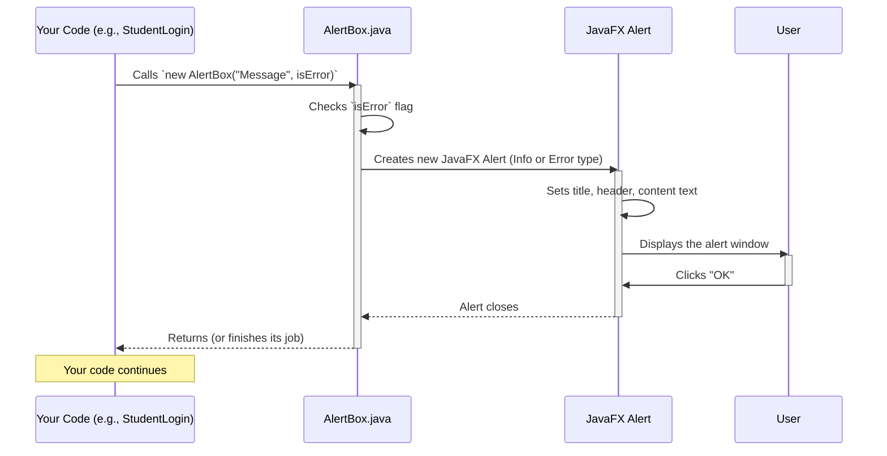

# Chapter 8: User Notification System

In [Chapter 7: Faculty Project Monitoring](07_faculty_project_monitoring_.md), we saw how faculty members can keep a close eye on the progress of student projects they mentor. Throughout our application, from logging in to submitting projects and monitoring tasks, users are constantly interacting with the system.

But what happens when something important occurs? How does the application tell the user: "Success! Your project was submitted!" or "Oops! That username already exists"?

This is where the **User Notification System** comes in! Think of it like the **dashboard of a car**. When you start the engine, a light confirms it's on. If you're low on fuel, a warning light flashes. If you successfully reach your destination, the navigation system might say "You have arrived!"

Our `Java-Project` needs a way to give clear, immediate feedback to its users.

### What Problem Does the User Notification System Solve?

Imagine if you submitted your project proposal, clicked "Submit," and then... nothing happened. You wouldn't know if it worked, if there was an error, or if the system was just thinking! This would be confusing and frustrating.

The **User Notification System** solves this by centralizing how messages are displayed, making sure users are always informed. It has two main jobs:

1.  **Confirming Success:** When an action goes right (like logging in, registering, or submitting a project), it tells the user with a clear, positive message.
2.  **Alerting Errors:** When something goes wrong (like an incorrect password, a database problem, or trying to register with an existing ID), it tells the user exactly what the problem is.

This system ensures that our application has a consistent "voice," always keeping the user in the loop, which greatly improves their experience and helps them understand what's happening.

### Key Concepts: Alerts and Custom Exceptions

Our User Notification System relies on two main ideas:

1.  **`AlertBox` (The Messenger):** This is a special user interface component that pops up a small window to display a message to the user. It's like the little pop-up notifications you see on your phone or computer.
2.  **Custom Exceptions (The Problem Reporters):** These are special Java classes that help us define *specific types* of problems that can happen in our application. Instead of just saying "something went wrong," a custom exception might say "Login Failed" or "Registration Failed: ID already exists." This allows us to give more precise feedback to the user.

### How to Use the `AlertBox` (The Messenger)

Let's start with `AlertBox`. It's incredibly simple to use! Whenever you need to show a message to the user, you just create a new `AlertBox` object.

**Example Use Case: Showing Login Feedback**

Remember the login process from [Chapter 2: User Account Management System](02_user_account_management_system_.md)? After checking credentials, the system needs to tell the user if the login was successful or not.

Here’s how `StudentLogin.java` uses `AlertBox`:

```java
// Snippet from Project/src/UI/StudentLogin.java (redirect method)
package UI;

// ... other imports ...

public class StudentLogin extends Login {
    // ... constructor and validate method ...

    @Override
    public void redirect(Stage loginStage, String Username, String Password, int id) {
        // This line creates and shows an AlertBox for successful login!
        new AlertBox("Student Login Successful", false); // 'false' means it's not an error

        // ... then redirects to the student dashboard ...
    }
}
```

**Explanation:**

*   `new AlertBox("Student Login Successful", false);`
    *   The first part, `"Student Login Successful"`, is the actual message that will be shown to the user.
    *   The second part, `false`, tells the `AlertBox` that this is an **information** message (not an error). If it were `true`, it would be an **error** message.

If there was an error during login, you might see something like this:

```java
// Example: If login fails in StudentLogin's validate method
// This part might be in a catch block for an exception
new AlertBox("Invalid Username or Password. Please try again.", true); // 'true' means it's an error
```

**Conceptual Output:**

Imagine a small pop-up window appearing:

*   **For `false` (Information):** A window titled "Information" with a blue 'i' icon, displaying "Student Login Successful."
*   **For `true` (Error):** A window titled "Error" with a red 'X' icon, displaying "Invalid Username or Password. Please try again."

### Internal Implementation: The `AlertBox` Code (`UI/AlertBox.java`)

Let's look at what's inside the `AlertBox.java` file. It's quite simple, leveraging JavaFX's built-in `Alert` class.

**High-Level Flow: How AlertBox Works**



**Code Dive: `UI/AlertBox.java`**

```java
// File: Project/src/UI/AlertBox.java
package UI;

import javafx.scene.control.Alert;      // The main Alert class from JavaFX
import javafx.scene.control.Alert.AlertType; // To specify if it's an error or info

public class AlertBox
{
	private Alert alert; // This will hold our JavaFX Alert object

	public AlertBox(String message, boolean isError)
	{
        // Check if it's an error message or an information message
        if (isError)
        {
            alert = new Alert(AlertType.ERROR); // Create an Alert of type ERROR
            alert.setTitle("Error");            // Set the window title
        }
        else
        {
            alert = new Alert(AlertType.INFORMATION); // Create an Alert of type INFORMATION
            alert.setTitle("Information");        // Set the window title
        }

        alert.setHeaderText(null);    // We don't use a separate header line
        alert.setContentText(message); // Set the main message to display

        // Show the alert window and wait for the user to close it (e.g., click OK)
        alert.showAndWait();
    }
}
```

**Explanation:**

1.  **`import javafx.scene.control.Alert;`**: This imports the special `Alert` class provided by JavaFX, which handles creating standard pop-up messages.
2.  **`private Alert alert;`**: This declares a variable to hold our `Alert` object.
3.  **`public AlertBox(String message, boolean isError)`**: This is the constructor. When you call `new AlertBox(...)`, this code runs.
    *   `message`: The text to display.
    *   `isError`: A `boolean` (true/false) to decide if it's an error.
4.  **`if (isError)` / `else` block**:
    *   If `isError` is `true`, it creates an `Alert` of `AlertType.ERROR` and sets the window title to "Error."
    *   If `isError` is `false`, it creates an `Alert` of `AlertType.INFORMATION` and sets the window title to "Information."
5.  **`alert.setHeaderText(null);`**: We keep the header blank for simplicity, so only our main message is prominent.
6.  **`alert.setContentText(message);`**: This sets the primary message that the user will read in the alert box.
7.  **`alert.showAndWait();`**: This is the key line! It makes the alert window appear on the screen and *pauses* our application until the user clicks an "OK" button or closes the alert.

### Custom Exceptions (The Problem Reporters)

While `AlertBox` shows the message, **Custom Exceptions** are crucial for *telling the system* what specific problem occurred. Why not just use `Exception` directly?

**Analogy:** Imagine your car. Instead of just a generic "engine problem" light, you get "low oil pressure" or "overheating." This specific information helps you (or the mechanic) fix the exact issue.

In programming, custom exceptions do the same:
*   They provide a clear, specific name for a problem (e.g., `LoginException`).
*   They carry a custom message describing the problem (e.g., "Invalid Username or Password").
*   They allow different parts of our code to "catch" and handle *specific* types of errors in different ways.

#### Example Use Case: `LoginException` in `StudentLogin.java`

Remember `StudentLogin.java` from [Chapter 2: User Account Management System](02_user_account_management_.md)? Its `validate` method needed to check credentials. If the database had an issue, it would throw an exception.

```java
// Snippet from Project/src/UI/StudentLogin.java (validate method)
package UI;

import java.sql.Connection;
import java.sql.PreparedStatement;
import java.sql.ResultSet;
import java.sql.SQLException;
import Connection.ConnectionManager;
import Exceptions.LoginException; // Our custom exception!

public class StudentLogin extends Login {
    // ... constructor ...

    @Override
    public boolean validate(String username, int digitalID, String password) throws LoginException {
        try {
            Connection con = ConnectionManager.getConnection();
            // ... SQL query to check credentials ...
            // ... (if login successful, returns true) ...
        } catch (SQLException e) {
            // If a database error occurs, we throw our specific LoginException!
            throw new LoginException("Error occurred while connecting with database");
        }
        // ... (if login fails for incorrect credentials, also throw LoginException) ...
        // For example: if (!isValidUser) { throw new LoginException("Invalid credentials!"); }
        return false; // Simplified for snippet
    }
}
```

**Explanation:**

*   `throws LoginException`: This tells us that the `validate` method *might* throw a `LoginException`.
*   `throw new LoginException("Error occurred while connecting with database");`: When a `SQLException` happens (meaning a problem with the database itself), instead of letting the `SQLException` propagate directly, we "wrap" it in our more user-friendly `LoginException`. This allows the UI to catch `LoginException` and display a clear message using `AlertBox`.

#### Code Dive: A Custom Exception (`Exceptions/LoginException.java`)

All our custom exceptions follow a very similar, simple structure. Let's look at `LoginException.java`.

```java
// File: Project/src/Exceptions/LoginException.java
package Exceptions;

public class LoginException extends Exception // It extends Java's built-in Exception
{
    public String message; // To store a specific message for this exception

    public LoginException(String msg) // Constructor to create a LoginException
    {
    	this.message = msg; // Store the message passed to the constructor
    }
}
```

**Explanation:**

1.  **`package Exceptions;`**: All our custom exceptions are organized in the `Exceptions` package.
2.  **`public class LoginException extends Exception`**: This is the crucial part. It tells Java that `LoginException` is a *type* of `Exception`. This means it has all the standard properties of an exception but is now specifically named "LoginException."
3.  **`public String message;`**: This variable will hold a detailed description of *why* the login failed (e.g., "Invalid credentials" or "Database connection error").
4.  **`public LoginException(String msg)`**: This is the constructor. When you create a `LoginException` (`new LoginException("...")`), you must provide a message. This message is then saved in the `message` variable.

This structure allows us to define many different types of problems, each with its own specific class:

| Exception Class                   | Purpose                                                     |
| :-------------------------------- | :---------------------------------------------------------- |
| `CheckStatusException`            | Problem checking project status.                            |
| `LoginException`                  | Issue during user login (e.g., wrong credentials).          |
| `NoUserFoundException`            | Attempted action for a user not found.                      |
| `ProjectAlreadySelectedException` | Trying to select a project already taken.                   |
| `ProjectRejectedException`        | Action failed because project was rejected.                 |
| `RegistrationFailedException`     | Problem during user registration.                           |
| `ViewTaskException`               | Issue viewing tasks (e.g., unauthorized access, no tasks).  |
| `displayStudException`            | General error displaying student project information.       |

Each of these custom exceptions helps the system and developers understand and react to errors much more precisely than a generic `Exception`.

### Conclusion

The **User Notification System** is fundamental for making our `Java-Project` user-friendly and robust. By using the `AlertBox` for consistent, clear feedback (both success and error messages) and leveraging **Custom Exception classes** to precisely define different types of problems, we ensure that users are always informed and that errors can be handled intelligently throughout the application. It acts as the "voice" of our system, ensuring smooth communication with everyone who uses it.

Now that our application can effectively communicate with users, what about managing the underlying data more efficiently? In the next chapter, we'll look at how we structure and organize data within our Java code itself.

Let's move on to [Chapter 9: Data Structure Wrappers](09_data_structure_wrappers_.md)!

---

<sub><sup>**References**: [[1]](https://github.com/itz-me-pandian/Java-Project/blob/e7cb64105871cfd762b59639ef8dcab04ae6c2f7/Project/src/Exceptions/CheckStatusException.java), [[2]](https://github.com/itz-me-pandian/Java-Project/blob/e7cb64105871cfd762b59639ef8dcab04ae6c2f7/Project/src/Exceptions/LoginException.java), [[3]](https://github.com/itz-me-pandian/Java-Project/blob/e7cb64105871cfd762b59639ef8dcab04ae6c2f7/Project/src/Exceptions/NoUserFoundException.java), [[4]](https://github.com/itz-me-pandian/Java-Project/blob/e7cb64105871cfd762b59639ef8dcab04ae6c2f7/Project/src/Exceptions/ProjectAlreadySelectedException.java), [[5]](https://github.com/itz-me-pandian/Java-Project/blob/e7cb64105871cfd762b59639ef8dcab04ae6c2f7/Project/src/Exceptions/ProjectRejectedException.java), [[6]](https://github.com/itz-me-pandian/Java-Project/blob/e7cb64105871cfd762b59639ef8dcab04ae6c2f7/Project/src/Exceptions/RegistrationFailedException.java), [[7]](https://github.com/itz-me-pandian/Java-Project/blob/e7cb64105871cfd762b59639ef8dcab04ae6c2f7/Project/src/Exceptions/ViewTaskException.java), [[8]](https://github.com/itz-me-pandian/Java-Project/blob/e7cb64105871cfd762b59639ef8dcab04ae6c2f7/Project/src/Exceptions/displayStudException.java), [[9]](https://github.com/itz-me-pandian/Java-Project/blob/e7cb64105871cfd762b59639ef8dcab04ae6c2f7/Project/src/UI/AlertBox.java)</sup></sub>