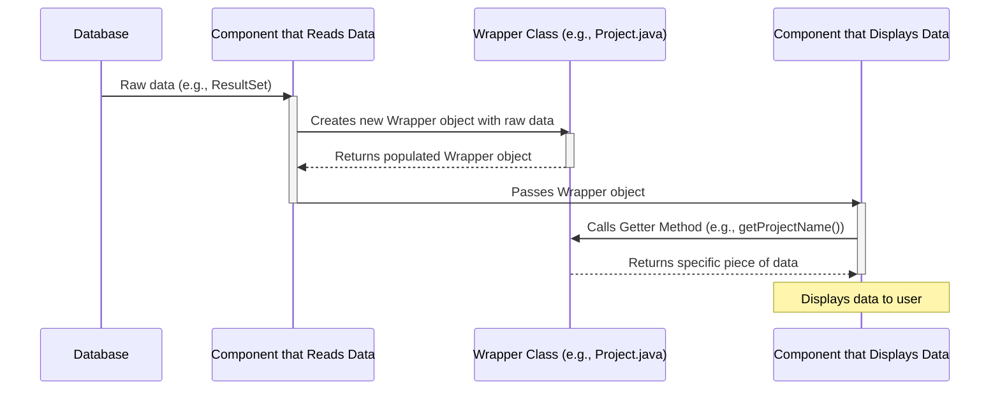

# Chapter 9: Data Structure Wrappers

In [Chapter 8: User Notification System](08_user_notification_system_.md), we learned how our application uses `AlertBox` and custom exceptions to communicate important messages and errors to users. Now that we know how to *talk* to our users, let's think about how we *organize* the information within our program itself.

Imagine you're preparing a lunchbox. Instead of just throwing in a sandwich, an apple, and a cookie separately, you might put the sandwich in a wrapper, the apple in a small container, and the cookie in a snack bag. You use these small containers to keep related items together and make everything neat.

In programming, we often have pieces of data that are naturally related. For example, a project isn't just an ID; it also has a name, a status, and maybe who is assigned to it. A student's task isn't just a "task name"; it's linked to a student, a project, and has a progress percentage.

This is where **Data Structure Wrappers** come in!

### What Problem Do Data Structure Wrappers Solve?

Think of our `Java-Project` application as having many "departments" (different screens and logical parts). Each department might need to handle information about projects, students, or tasks.

If we didn't have a way to group related data, imagine trying to pass all the details of a project from one part of the code to another:

`// Bad example: Passing many separate pieces of information`
`displayProjectDetails(projectId, projectName, projectStatus, facultyName, facultyId, student1Id, student1Task, student2Id, student2Task);`

This quickly becomes messy, hard to read, and error-prone! If you forget one variable, or mix up their order, your code will break.

**Data Structure Wrappers** solve this problem by letting us gather several related pieces of data into a **single, neat object**. They are small, simple classes whose main purpose is to act as a **container** to hold and carry this related information together.

They are like pre-labeled boxes for specific items (e.g., a "Project Box" with ID, Name, Status, or a "Student Task Box" with student, task, and progress details). This makes it much easier and safer to pass data around our application.

### Key Concept: The "Wrapper Class"

A **wrapper class** (also often called a "Plain Old Java Object" or POJO, or a "Data Transfer Object" or DTO) is a very straightforward class that typically includes:

1.  **Private Fields (Variables):** These hold the actual pieces of data (e.g., `projectId`, `projectName`). Making them `private` means they can only be directly accessed from inside the class itself.
2.  **Constructor:** A special method that helps you create new objects of this class and fill in its initial data.
3.  **Public "Getter" Methods:** These methods allow other parts of your program to *read* the data stored in the private fields. You ask the wrapper object: "Hey, what's your project name?" using `getProjectName()`.

The beauty of a wrapper class is its simplicity: it doesn't usually contain complex logic; it just holds data.

### How to Use Data Structure Wrappers (Concrete Examples)

Let's look at a few examples from our `Java-Project` where we use wrapper classes to keep data organized.

#### Example 1: `Admin.Project.java` (Project Details for Approval)

Recall from [Chapter 5: Project Approval System (Admin)](05_project_approval_system__admin__.md) how administrators approved projects. When the system displayed a list of projects, each project had an ID, name, status, and even "Accept" and "Reject" buttons.

Instead of handling each of these items separately, our application uses a `Project` wrapper class to group them together for each individual project.

```java
// File: Project/src/Admin/Project.java
package Admin;

import javafx.scene.control.Button;

public class Project // This is our wrapper class!
{
    private int projectId;       // Private field for project ID
    private String projectName;  // Private field for project Name
    private String status;       // Private field for project Status
    private Button acceptButton; // Private field for the Accept button
    private Button rejectButton; // Private field for the Reject button

    // Constructor: This helps us create a 'Project' object and fill its data
    public Project(int projectId, String projectName, String status, Button acceptButton, Button rejectButton) {
        this.projectId = projectId;
        this.projectName = projectName;
        this.status = status;
        this.acceptButton = acceptButton;
        this.rejectButton = rejectButton;
    }

    // Getter methods: These allow other parts of the program to read the data
    public int getProjectId() { return projectId; }
    public String getProjectName() { return projectName; }
    public String getStatus() { return status; }
    public Button getAcceptButton() { return acceptButton; }
    public Button getRejectButton() { return rejectButton; }
}
```

**Explanation:**
*   This `Project` class acts as a single "box" that holds all the essential details for one project.
*   When the `changeStatus.java` UI ([Chapter 5: Project Approval System (Admin)](05_project_approval_system__admin__.md)) fetches project data from the database, it creates a `Project` object for each project.
*   Instead of passing 5 separate variables, `changeStatus.java` can now simply pass a single `Project` object to the `TableView` (a UI component that displays data in rows and columns). The `TableView` then uses the `get...()` methods to display each piece of information in the correct column.
*   **Output (Conceptual):** When `getProjectName()` is called on a `Project` object, it would return the name of that specific project, e.g., "AI Chatbot Development."

#### Example 2: `Faculty.viewTaskUI.java`'s `Task` (Student Task Details for Faculty)

In [Chapter 7: Faculty Project Monitoring](07_faculty_project_monitoring_.md), faculty members could view the detailed tasks of students within a project. To display each student's task details in a table, we use another wrapper class.

```java
// File: Project/src/Faculty/viewTaskUI.java (Snippet - inner class for TableView)
package Faculty;

// ... other imports ...

public class viewTaskUI extends Application {
    // ... other methods and fields ...

    // A simple class to hold one row of task data for the TableView
    public static class Task // This is our wrapper for a student's task!
    {
        private String studentName; // Private field for student's name
        private String taskName;    // Private field for task description
        private int taskProgress;   // Private field for task completion percentage

        public Task(String studentName, String taskName, int taskProgress) {
            this.studentName = studentName;
            this.taskName = taskName;
            this.taskProgress = taskProgress;
        }

        // Getter methods to access the wrapped data
        public String getStudentName() { return studentName; }
        public String getTaskName() { return taskName; }
        public int getTaskProgress() { return taskProgress; }
    }
}
```

**Explanation:**
*   The `Task` class wraps the `studentName`, `taskName`, and `taskProgress` together.
*   When the `viewTaskUI` fetches data from the database, it creates a `Task` object for each student's task and adds it to a `List`.
*   This `List` of `Task` objects is then easily given to a `TableView` to display, making the code much cleaner than handling three separate lists of names, tasks, and progress.
*   **Output (Conceptual):** If you have a `Task` object and call `getTaskProgress()`, it might return `75` (meaning 75%).

#### Example 3: `Student.StudentTask.java`'s `TaskDetails` (Single Student's Task View)

When a student views their own task ([Chapter 6: Student Project Submission & Task Tracking](06_student_project_submission___task_tracking_.md)), the system needs to display their `Project Name`, their `Task Name`, and their `Task Progress`.

```java
// File: Project/src/Student/StudentTask.java (Snippet - inner class for Task details)
package Student;

// ... other imports ...

// class for Wrapping the Task details of a particular student
class TaskDetails // This is another wrapper class!
{
    private String projectName;  // Project this task belongs to
    private String taskName;     // The name of the student's task
    private String taskProgress; // The progress of that task

    public TaskDetails(String projectName, String taskName, String taskProgress) {
        this.projectName = projectName;
        this.taskName = taskName;
        this.taskProgress = taskProgress;
    }

    // Getter methods with simplified null checks
    public String getProjectName() {
        return (projectName != null) ? projectName : "Not Involved in any Project!";
    }
    public String getTaskName() {
        return (taskName != null) ? taskName : "Not Involved in any Task";
    }
    public String getTaskProgress() {
        return (taskProgress != null) ? taskProgress : "Error in getting Progress";
    }
}
```

**Explanation:**
*   This `TaskDetails` class groups the `projectName`, `taskName`, and `taskProgress` for a *single* student's task.
*   The `ViewProject` helper class creates one `TaskDetails` object after fetching the student's information from the database.
*   This single `TaskDetails` object can then be passed to the `StudentTask` UI to display, simplifying how that information is handled and retrieved.
*   **Output (Conceptual):** Calling `getProjectName()` on a `TaskDetails` object might return "Student Management System."

#### Example 4: `Student.projectPage.java`'s `ProjectTask` (Team Tasks for Student Project Page)

The student's project page ([Chapter 6: Student Project Submission & Task Tracking](06_student_project_submission___task_tracking_.md)) shows a table of all team members and their tasks.

```java
// File: Project/src/Student/projectPage.java (Snippet - inner class for TableView)
package Student;

// ... other imports ...

public class projectPage extends Application {
    // ... other methods and fields ...

    public static class ProjectTask // This wrapper holds info for one row in the student's project table
    {
        private String taskName;     // Name of the specific task
        private String taskProgress; // Progress of that task
        private String studentName;  // Name of the student assigned this task

        public ProjectTask(String taskName, String taskProgress, String studentName) {
            this.taskName = taskName;
            this.taskProgress = taskProgress;
            this.studentName = studentName;
        }

        // Getter methods
        public String getTaskName() { return taskName; }
        public String getTaskProgress() { return taskProgress; }
        public String getStudentName() { return studentName; }
    }
}
```

**Explanation:**
*   This `ProjectTask` wrapper is used to represent a single row in the table on a student's project overview page.
*   It combines the `taskName`, `taskProgress`, and the `studentName` responsible for that task.
*   `projectPage.java` populates its `TableView` with a list of these `ProjectTask` objects, making it easy to display all team members' tasks.

### Why Do We Use Data Structure Wrappers? (Benefits)

Data structure wrappers bring several important advantages to our `Java-Project`:

| Benefit        | Description                                                  | Example                                                    |
| :------------- | :----------------------------------------------------------- | :--------------------------------------------------------- |
| **Organization** | Keeps related pieces of data neatly grouped.                 | All details of one `Project` are in one `Project` object.    |
| **Readability**  | Code becomes easier to understand at a glance.               | `myProject.getProjectName()` is clearer than just `projectName`. |
| **Maintainability** | If you add a new field (e.g., `projectDeadline`), you only change the wrapper class, not every method that uses project data. | Adding `projectDeadline` only affects `Project.java`, not every `displayProjectDetails` call. |
| **Data Transfer** | Easier to pass a single object containing all related data instead of many individual arguments. | Pass one `Project` object instead of 5 separate variables.  |
| **Type Safety**  | Java ensures you're always using the correct type of data, reducing errors. | You can't accidentally put a `String` where an `int` `projectId` should be. |

### Internal Flow: How a Wrapper Works

Let's visualize a simplified journey of data using a wrapper:



**Step-by-Step Breakdown:**

1.  **Raw Data from Database:** A component (like `changeStatus.java` or `viewTaskUI.java`) connects to the [Database Connection Manager](04_database_connection_manager_.md) and fetches raw data (e.g., a `ResultSet` containing rows and columns).
2.  **Create Wrapper Object:** For each row of raw data, the component creates a new instance of a wrapper class (e.g., `new Project(...)`).
3.  **Populate Wrapper:** The raw data (like project ID, name, status) is used to fill in the `private` fields of the new wrapper object using its constructor.
4.  **Pass Wrapper:** This single, neatly packaged wrapper object is then passed to other parts of the application, often a UI component like a `TableView`.
5.  **Access Data via Getters:** The UI component doesn't access the `private` fields directly. Instead, it uses the `public` "getter" methods (like `getProjectId()`, `getProjectName()`) to retrieve specific pieces of data from the wrapper object when it needs to display them.

### Conclusion

**Data Structure Wrappers** are simple yet incredibly powerful tools in our `Java-Project`. They help us organize related pieces of data into single, meaningful objects, which greatly improves the readability, maintainability, and safety of our code. By packaging information like project details, student tasks, or faculty assignments into dedicated wrapper classes, we ensure that data is handled efficiently and consistently throughout the application. They are essential for building a robust and understandable codebase.

Now that we understand how data is organized within our application, we can appreciate how these structures help in managing more complex interactions.

This marks the end of our tutorial for `Java-Project`! You've learned about the entire system, from its launch to user accounts, role-specific interfaces, database interactions, project management features, notifications, and internal data organization.

---

<sub><sup>**References**: [[1]](https://github.com/itz-me-pandian/Java-Project/blob/e7cb64105871cfd762b59639ef8dcab04ae6c2f7/Project/src/Admin/Project.java), [[2]](https://github.com/itz-me-pandian/Java-Project/blob/e7cb64105871cfd762b59639ef8dcab04ae6c2f7/Project/src/Faculty/viewTaskUI.java), [[3]](https://github.com/itz-me-pandian/Java-Project/blob/e7cb64105871cfd762b59639ef8dcab04ae6c2f7/Project/src/Student/StudentInfo.java), [[4]](https://github.com/itz-me-pandian/Java-Project/blob/e7cb64105871cfd762b59639ef8dcab04ae6c2f7/Project/src/Student/StudentTask.java), [[5]](https://github.com/itz-me-pandian/Java-Project/blob/e7cb64105871cfd762b59639ef8dcab04ae6c2f7/Project/src/Student/projectPage.java)</sup></sub>